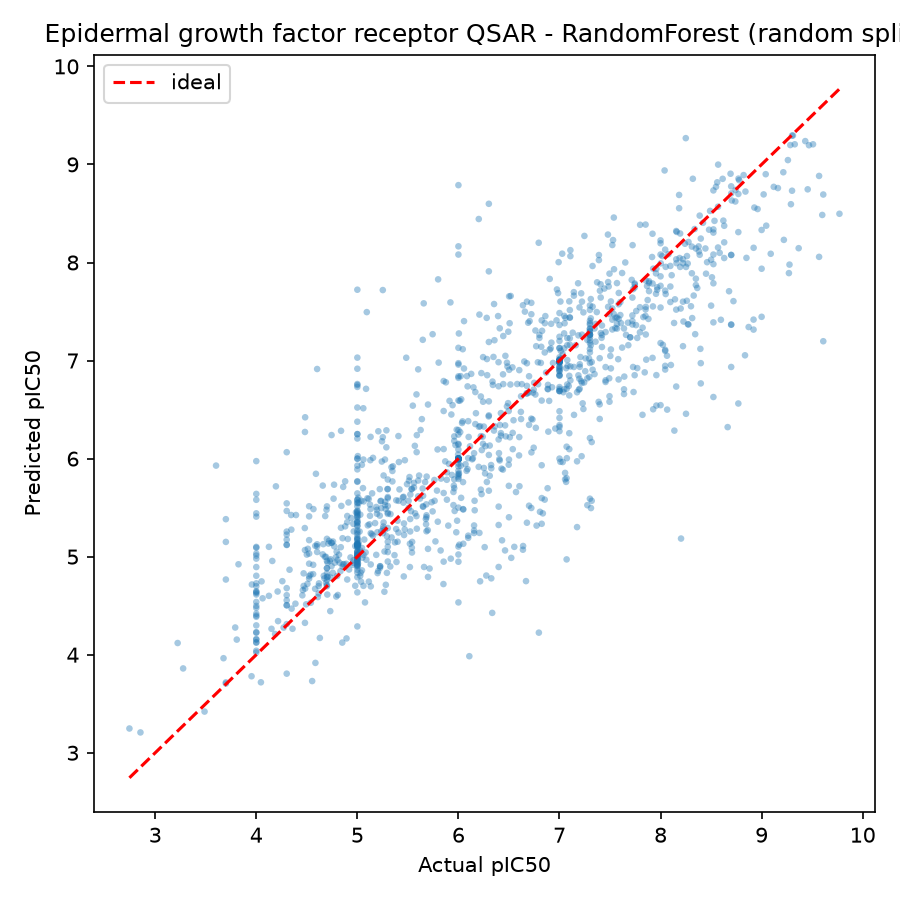
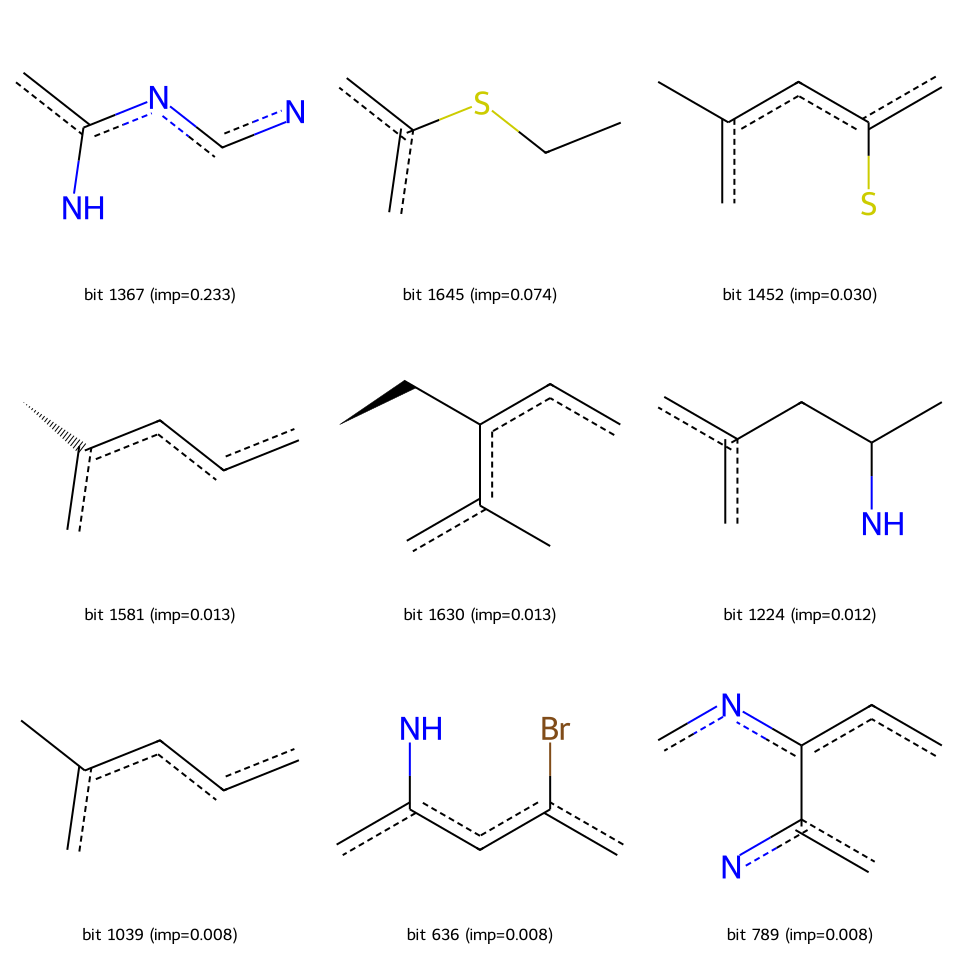
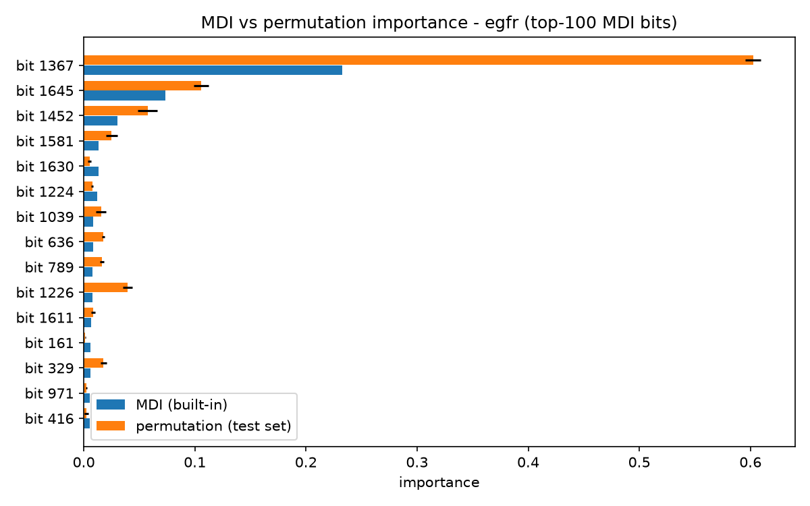
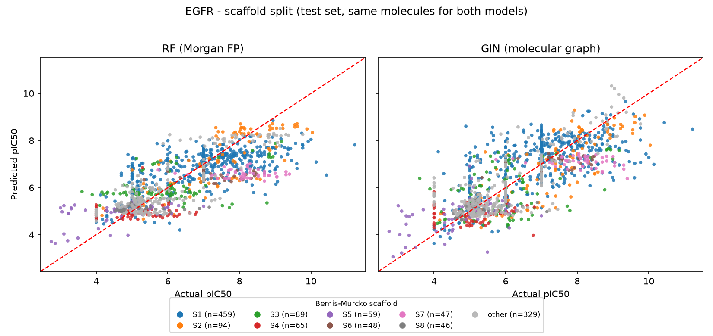
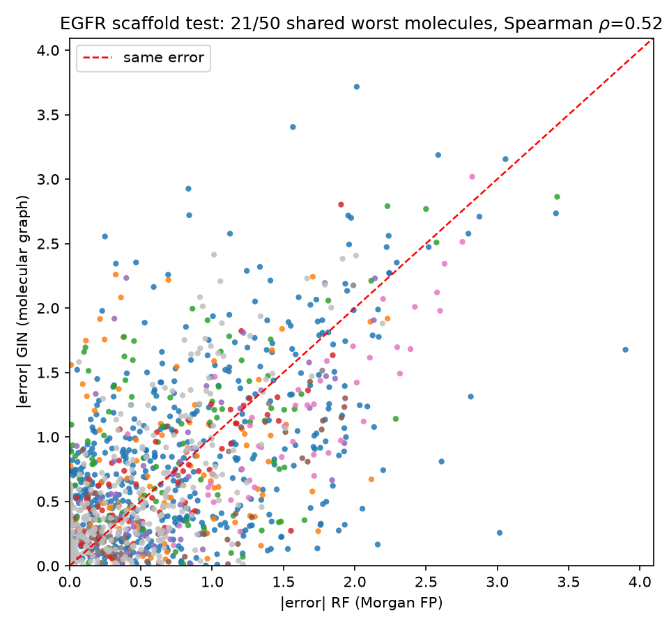

# QSAR Activity Prediction with Machine Learning

Predicting molecular properties from structure, two ways, under identical
train/test conditions:

- **Phase 1 (classic QSAR)**: ChEMBL data -> cleaning -> Morgan
  fingerprints -> RandomForest -> evaluation -> interpretation.
- **Phase 2 (GNN)**: the same molecules as molecular graphs -> GIN
  (Graph Isomorphism Network) -> a controlled RF-vs-GNN comparison
  (section 7), including an error-overlap analysis and a MoleculeNet ESOL
  benchmark run.

## 1. What this project does

Given a compound's structure (SMILES), predict how potently it inhibits the
target (pIC50). This is the computational first stage of **virtual
screening**: rank large virtual libraries in silico before spending wet-lab
budget on the top hits. Phase 2 then asks whether graph neural networks
improve on the classic fingerprint baseline when the comparison is fair.

## 2. Results

EGFR (primary dataset, 6165 unique compounds, test = 20%):

| Split | R2 | RMSE | MAE |
|---|---|---|---|
| random | **0.747** | 0.692 | 0.492 |
| scaffold | **0.562** | 0.950 | 0.708 |

The gap between the two splits is the expected fingerprint of analogue
leakage: a random split lets near-identical compounds land on both sides and
inflates the score; the scaffold split (whole Bemis-Murcko scaffolds held
out) approximates predicting genuinely new chemotypes - the honest number.

Predicted vs actual (EGFR, random split):



Fallback dataset (BACE-1, 1513 compounds):

| Split | R2 | RMSE | MAE |
|---|---|---|---|
| random | 0.646 | 0.792 | 0.572 |
| scaffold | 0.640 | 0.616 | 0.481 |

For BACE the two RMSEs are inverted (random > scaffold) **because the test
sets have different potency spreads** - the random test set is wider
(std 1.33, range 2.7-10.5) than the scaffold one (std 1.03, range 3.9-9.0).
R2 is scale-free, RMSE is not. See `figures/testset_hist_bace.png`.

## 3. Data

Two sources, switched via the `QSAR_TAG` environment variable:

| Dataset | Target | Compounds | Source |
|---|---|---|---|
| `egfr` (default) | EGFR (CHEMBL203) | 6165 | ChEMBL REST API |
| `bace` (fallback) | Beta-secretase 1 | 1513 | MoleculeNet BACE |

Primary data comes from **ChEMBL** (EBI): `target_chembl_id=CHEMBL203`,
`standard_type=IC50`, `standard_units=nM`, binding/functional assays. While
this project was built the ChEMBL API was intermittently returning HTTP 500
(server-side outage; a VPN did not help). The downloader
(`scripts/01d_download_incremental.py`) therefore retries every page,
flushes each page to disk, and skips poisoned result windows - 8936 rows
survived into 6165 unique compounds.

Cleaning (`scripts/02_clean_data.py`):
- keep only IC50 reported in **nM** (one unit -> comparable numbers)
- drop rows with missing SMILES/IC50 and non-positive IC50
- IC50 (nM) -> **pIC50 = -log10(IC50 x 1e-9)**; cross-checked against
  ChEMBL's own `pchembl_value` (100% agreement)
- compounds measured multiple times are collapsed to the **median** pIC50

## 4. Method

- **Featurization**: 2048-bit Morgan fingerprints (radius 2) with RDKit.
  Each bit encodes a circular atomic neighbourhood, so similar structures
  yield similar vectors.
- **Model**: `RandomForestRegressor`, tuned with `GridSearchCV` (5-fold CV
  on the training set only): n_estimators x max_depth x min_samples_split.
- **Splits**: random 80/20 (`random_state=42`) and a **scaffold split**
  implemented with RDKit only (no DeepChem dependency).

## 5. Interpretation

EGFR top fingerprint bits mapped back to the substructures that set them
(`scripts/05_explain_bits.py`):



The dominant bit (MDI 0.233, carried by 2762/6165 compounds) decodes to an
**aminopyrimidine** - the classic kinase hinge-binding motif, exactly what a
medicinal chemist would expect for EGFR.

Because RandomForest's built-in (MDI) importance is known to be inflated
for correlated features - and 2048 fingerprint bits contain many chemically
equivalent ones - every importance claim above was cross-checked with
**permutation importance on the held-out test set**
(`scripts/07_qc_checks.py`):

- EGFR: bit 1367 drops test R2 by **0.60** when permuted - the MDI ranking
  *under*casts it. Top-100 MDI-vs-permutation Spearman = 0.664.
- BACE: agreement is weaker (Spearman 0.349). MDI ranks the rare
  fluorinated-aromatic bit 964 first; permutation ranks the broadly carried
  oxygen environment first and bit 964 third - still important, but the
  substructure story must be told at the set level, not as "the one bit".



## 6. Data QC

- **Ultra-potent audit** (pIC50 > 9, i.e. IC50 < 1 nM): EGFR has 326 such
  rows (3.7%), but they spread across many independent assays and documents
  (largest single source: 14%) - consistent with genuinely potent
  inhibitors, not unit mislabels. BACE has 8 rows (0.5%) from a single FRET
  assay, also kept. No filtering rule was needed; the audit itself is the
  deliverable.
- **Inactive-end censoring**: the EGFR scatter plot shows vertical
  striations at low pIC50 (e.g. many compounds pinned at exactly 5.0 =
  IC50 10000 nM) - assay detection limits reporting "inactive above X".
  Known QSAR nuisance, visible in the data.
- **Test-set distributions** are compared before trusting any RMSE
  (see section 2).

## 7. GNN vs traditional QSAR: a controlled comparison

Phase 2 of this project asks a sharper question: **on the same molecules
and the same train/test partitions, does a graph neural network beat
Morgan fingerprints + RandomForest?**

### 7.1 Controlling the comparison

- Same data: the cleaned EGFR set above (6165 compounds, pIC50).
- Same splits: the RF pipeline never saved its split indices, so they
  were regenerated with the identical code (random_state=42; deterministic
  scaffold assignment) and **verified bit-identically**: re-predicting
  with the saved RF models reproduces the published metrics to 7 decimal
  places (`scripts/gnn_01_make_splits.py` aborts if this check fails).
- The GNN additionally gets a 10% validation carve-out from *train*
  (seed 42) for early stopping; test molecules are untouched, so the
  comparison stays paired. All indices are persisted under
  `data/processed/splits/`.
- Molecules are graphs: atoms = nodes (9 categorical features: atomic
  number, chirality, degree, formal charge, num H, radical electrons,
  hybridization, aromaticity, ring membership), bonds = undirected edges
  (bond type, stereo, conjugation) - the MoleculeNet/OGB featurization
  convention (`scripts/gnn_graph_dataset.py`), cached as one CSR-style
  npz (`scripts/gnn_02_build_graphs.py`).

### 7.2 Model

GIN (Graph Isomorphism Network), the canonical MoleculeNet baseline:
AtomEncoder (sum of per-feature embeddings) -> 4 x [GINConv -> BatchNorm
-> ReLU -> dropout, residual] -> global mean pool -> MLP head. PyTorch
Geometric, trained on an Apple M4 (MPS). Bond features are unused (plain
GINConv aggregates node features only); pooling is mean rather than the
paper's sum so prediction scale does not couple to molecule size. Target
standardized with train statistics; metrics reported in original pIC50
units (`scripts/gnn_03_train_gin.py`).

### 7.3 Results

| Split | RF R2 / RMSE | GIN R2 / RMSE (seed 42) | GIN R2 mean +- std (3 seeds) |
|---|---|---|---|
| random | 0.747 / 0.692 | 0.691 / 0.765 | 0.690 +- 0.001 |
| scaffold | 0.562 / 0.950 | 0.544 / 0.969 | 0.526 +- 0.016 |

**On this dataset the GIN does not beat the fingerprint RF.** The random
split gap (-0.06 R2) is stable across seeds; the scaffold gap is small
and within seed noise, with the RF number sitting ~2 std above the GIN
mean. Both models lose ~0.2 R2 from random to scaffold - novel chemotypes
are hard for both feature types.

Predicted vs actual on the identical test molecules, coloured by
Bemis-Murcko scaffold:



### 7.4 Hyperparameters: an honest negative result

A bounded tuning pass (300 epochs + ReduceLROnPlateau, dropout {0.2, 0.3})
improved validation RMSE for one config (0.517 vs 0.533, standardized
units) but **degraded** test R2 (0.525 vs 0.544): with only ~490
validation molecules, best-epoch selection was fitting validation noise.
All three configs land at test R2 0.52-0.54, so the simplest recipe was
kept as the final model rather than reporting a best-of-three test
number. Tuning artifacts are kept as `results/*_tuneA/B.*`.

### 7.5 Error analysis: do the models fail on the same molecules?

`scripts/gnn_05_error_analysis.py`:

- Of each model's 50 worst-predicted test molecules, **25/50 (random) and
  21/50 (scaffold) are shared**, against a random expectation of ~2.
  Per-molecule absolute errors correlate at Spearman ~0.52. Many failures
  are therefore **molecule-intrinsic** (noisy or assay-censored
  measurements, cf. section 6), not model-specific - a data-quality
  conclusion, not a model-ranking one.
- Failure modes still differ by chemotype. On the scaffold test set, a
  chromone series (n=37) costs the GIN 1.12 mean |error| vs RF's 0.64,
  while a thienopyrimidine series (n=47) costs RF 1.60 vs GIN's 1.16 -
  fingerprints and message passing generalize differently across
  scaffold space.



### 7.6 External benchmark: MoleculeNet ESOL

To show the pipeline is not tuned to one in-house dataset, the same GIN
(featurizer, split protocol, hyperparameters) was run on the public ESOL
aqueous-solubility benchmark (1128 molecules, log mol/L):

| Split | GIN R2 / RMSE |
|---|---|
| random | 0.913 / 0.642 |
| scaffold | 0.597 / 1.158 |

The random-split number is in line with published GNN results on ESOL
(random-split RMSE roughly 0.5-0.9 depending on protocol); the scaffold
number is much lower, as expected when whole chemotypes are held out.

## Repository layout

```
qsar-activity-prediction/
├── README.md
├── data/
│   ├── raw/            # downloaded activities (gitignored, see data/README.md)
│   └── processed/      # cleaned pIC50 CSVs, fingerprint/graph npz, splits/
├── notebooks/          # qsar_pipeline.ipynb (auto-generated from scripts/)
├── scripts/            # runnable pipeline, one step per file
│   ├── 01-07_*         # phase 1: ChEMBL -> Morgan FP -> RF (QSAR)
│   └── gnn_*           # phase 2: molecular graphs -> GIN, comparison, ESOL
├── figures/            # scatter plots, substructure grids, QC plots
├── models/             # trained RandomForests (gitignored, large)
└── results/            # metrics/predictions for both phases (gnn_* = phase 2)
```

## Reproduce

```bash
python -m venv .venv && source .venv/bin/activate
pip install -r requirements.txt

# phase 1 - classic QSAR (RF on Morgan fingerprints)
export QSAR_TAG=egfr   # or: bace
python scripts/01d_download_incremental.py     # egfr only
python scripts/02_clean_data.py
python scripts/03_featurize.py
python scripts/04_train_and_evaluate.py
python scripts/05_explain_bits.py
python scripts/07_qc_checks.py

# phase 2 - GNN on molecular graphs, compared against the same splits
python scripts/gnn_01_make_splits.py           # regenerate + VERIFY splits
python scripts/gnn_02_build_graphs.py          # SMILES -> graph cache
python scripts/gnn_03_train_gin.py --split random
python scripts/gnn_03_train_gin.py --split scaffold
python scripts/gnn_04_compare.py               # table + scaffold-coloured scatter
python scripts/gnn_05_error_analysis.py        # shared-failure analysis

# bonus: MoleculeNet ESOL benchmark
python scripts/gnn_06_esol_prep.py
QSAR_TAG=esol python scripts/gnn_03_train_gin.py --split scaffold
QSAR_TAG=esol python scripts/gnn_03_train_gin.py --split random
```

## Why pIC50?

Raw IC50 spans several orders of magnitude. The heavy tail dominates
least-squares training; pIC50 is roughly normal and is the standard QSAR
target transform.

## Interview talking points

1. **Why pIC50** - order-of-magnitude target standardisation.
2. **Why scaffold split** - random splits leak analogues across
   train/test and inflate scores; scaffold splits emulate new-chemotype
   prediction. This project's EGFR numbers show the effect directly
   (0.747 random vs 0.562 scaffold).
3. **Honest importance** - MDI is biased under correlated features; all
   substructure claims were validated with permutation importance on the
   held-out set before being made.
4. **Industry use** - first stage of virtual screening: in silico triage of
   large libraries before experimental validation, cutting wet-lab cost by
   orders of magnitude.
5. **Controlled GNN vs RF comparison** - same molecules, splits verified
   bit-identical (saved RF models reproduce the original metrics to 7
   decimals on the regenerated indices). Result: the GIN does *not* beat
   fingerprints here - on ~4.4k training molecules, message passing buys
   nothing over circular substructure counts, and both drop ~0.2 R2 on
   novel scaffolds.
6. **Negative results reported** - a scheduler/dropout tuning pass
   improved validation but degraded test (validation-set selection noise);
   the simplest recipe was kept. GIN scaffold-split R2 varies +-0.02
   across seeds - single-seed GNN comparisons are meaningless.
7. **Failure-mode analysis** - the two models' 50 worst molecules overlap
   21-25x more than chance (Spearman ~0.52): many failures are
   molecule-intrinsic (assay censoring/noise), yet specific chemotypes
   fail asymmetrically (chromones hurt the GIN more, thienopyrimidines
   hurt RF more) - fingerprints and graphs extrapolate differently.
