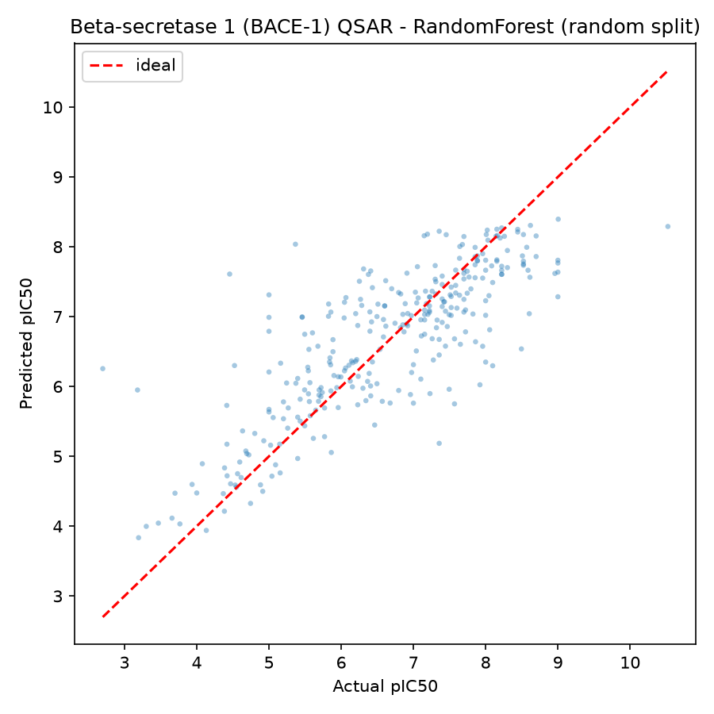
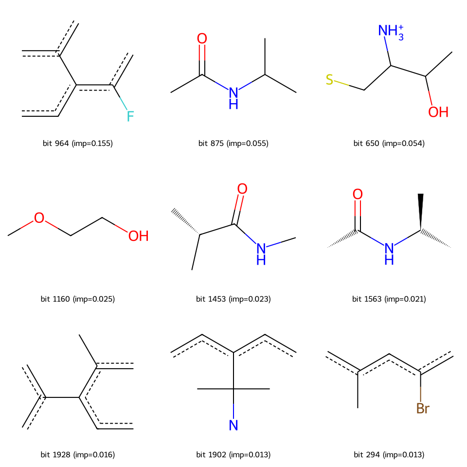

# QSAR Activity Prediction with Machine Learning

Predicting the bioactivity (pIC50) of compounds against a drug target from
their molecular structure, using the classic QSAR workflow:
**ChEMBL data -> cleaning -> Morgan fingerprints -> RandomForest -> evaluation**.

## 1. What this project does

Given a compound's structure (SMILES), predict how potently it inhibits the
target (pIC50). This is the computational half of **virtual screening**:
rank hundreds of thousands of virtual compounds before spending wet-lab money
on the top hits.

## 2. Data

Two sources (switch with the `QSAR_TAG` environment variable):

| Dataset | Target | Rows | Source |
|---|---|---|---|
| `egfr` (default) | EGFR (CHEMBL203) | downloading via ChEMBL REST API | ChEMBL |
| `bace` (fallback) | Beta-secretase 1 (BACE-1) | 1513 compounds | MoleculeNet BACE |

The primary source is the **ChEMBL database** (EBI). During this project the
ChEMBL API was intermittently returning HTTP 500, so
`scripts/01d_download_incremental.py` retries every page, flushes each page
to disk, and skips poisoned result windows. The fallback dataset
(MoleculeNet BACE-1) keeps the full pipeline runnable end-to-end at any time.

Cleaning (`scripts/02_clean_data.py`):
- keep only IC50 values reported in **nM** (one unit -> comparable numbers)
- drop rows with missing SMILES or IC50, and non-positive IC50
- convert IC50 (nM) -> **pIC50 = -log10(IC50 x 1e-9)**
- compounds measured multiple times are collapsed to the **median** pIC50

## 3. Method

- **Featurization**: 2048-bit Morgan fingerprints (radius 2) with RDKit.
  Each bit encodes a circular atomic neighbourhood, so similar structures
  yield similar vectors - the signal tree-based models learn from.
- **Model**: `RandomForestRegressor`, hyperparameters tuned with
  `GridSearchCV` (5-fold CV on the training set only).
- **Splits**: plain random 80/20 *and* a **scaffold split**
  (Bemis-Murcko scaffolds kept whole across train/test). Random splits let
  near-identical analogues leak into both sides and inflate the score; the
  scaffold split approximates the real use case - predicting activity for
  **new chemotypes**.

Predicted vs actual (BACE-1, random split):



## 4. Results

BACE-1 (1513 compounds, test = 20%):

| Split | R2 | RMSE | MAE |
|---|---|---|---|
| random | 0.646 | 0.792 | 0.572 |
| scaffold | 0.640 | 0.616 | 0.481 |

The scaffold split holding up (R2 0.64 with the largest chemotypes held
out) indicates the model captures transferable structure-activity
relationships rather than memorising analogue series.

Top fingerprint bits by feature importance, mapped back to substructures
(`scripts/05_explain_bits.py`):



The dominant bit (importance 0.155) captures a fluorinated aromatic
environment carried by only 70 of 1513 compounds - a rare but highly
informative motif.

## Repository layout

```
qsar-activity-prediction/
├── README.md
├── data/
│   ├── raw/            # downloaded activities (gitignored, see data/README.md)
│   └── processed/      # cleaned pIC50 CSVs + fingerprint npz
├── notebooks/          # qsar_pipeline.ipynb (auto-generated from scripts/)
├── scripts/            # runnable pipeline, one step per file
├── figures/            # scatter plots + substructure grids
├── models/             # trained RandomForest (joblib)
└── results/            # metrics.json + top_bits.csv
```

## Reproduce

```bash
python -m venv .venv && source .venv/bin/activate
pip install -r requirements.txt

# primary: EGFR from ChEMBL
python scripts/01d_download_incremental.py
python scripts/02_clean_data.py && python scripts/03_featurize.py
python scripts/04_train_and_evaluate.py && python scripts/05_explain_bits.py

# or the fallback dataset:
QSAR_TAG=bace python scripts/01alt_download_bace.py
QSAR_TAG=bace python scripts/02_clean_data.py && ...
```

## Why pIC50?

Raw IC50 spans several orders of magnitude (nM to uM). The heavy tail
dominates least-squares training; pIC50 is roughly normal and is the
standard QSAR target transform.

## Interview talking points

1. **Why pIC50** - order-of-magnitude target standardisation (see above).
2. **Why scaffold split** - random splits overestimate generalisation because
   analogues land on both sides; scaffold splits emulate new-chemotype
   prediction.
3. **Industry use** - this model type is the first stage of virtual
   screening: in silico triage of huge libraries before experimental
   validation, cutting wet-lab cost by orders of magnitude.
