# QSAR Activity Prediction with Machine Learning


Predicting how potently a compound inhibits a target (pIC50) from
structure, two ways under identical verified train/test conditions:
classic QSAR (Morgan fingerprints -> RandomForest) and a GIN graph
network, across eight ChEMBL targets plus a MoleculeNet fallback.
Headline, an honest negative result: **the GIN does not beat the tuned
fingerprint baseline on this panel**. Deep detail:
[docs/methodology.md](docs/methodology.md); interview prep:
[docs/interview.md](docs/interview.md).

## Results

### EGFR (primary dataset, 6165 unique compounds, test = 20%)

| Split | R2 | RMSE | MAE |
|---|---|---|---|
| random | **0.747** | 0.692 | 0.492 |
| scaffold | **0.562** | 0.950 | 0.708 |

The random-vs-scaffold gap is the expected fingerprint of analogue
leakage: random splits let near-identical compounds land on both sides,
inflating scores; the scaffold split (whole Bemis-Murcko scaffolds held
out; **largest scaffold groups are assigned to test first** - the
reverse of DeepChem's `ScaffoldSplitter`, see [Method](#method))
approximates genuinely new chemotypes - the honest number.

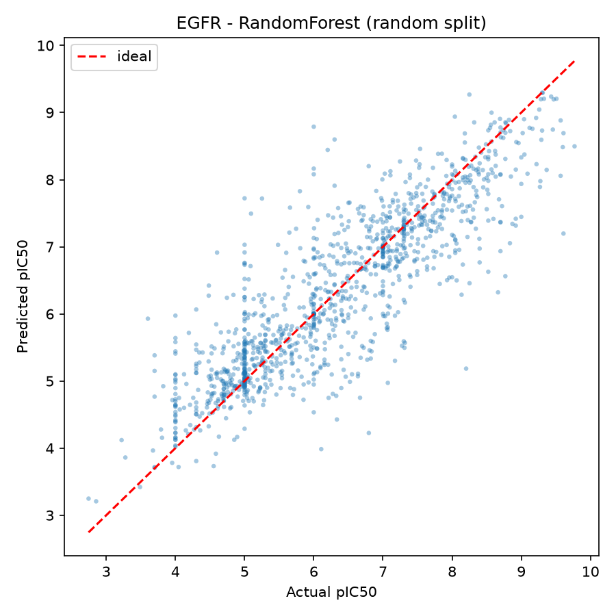

### Fallback dataset (BACE-1, 1513 compounds)

| Split | R2 | RMSE | MAE |
|---|---|---|---|
| random | 0.646 | 0.792 | 0.572 |
| scaffold | 0.640 | 0.616 | 0.481 |

For BACE the two RMSEs are inverted (random > scaffold) **because the
test sets have different potency spreads** - random is wider (std 1.33,
range 2.7-10.5) vs scaffold (std 1.03, range 3.9-9.0). R2 is scale-free,
RMSE is not. See `figures/testset_hist_bace.png`.

### Eight-target panel

Test R2; GIN = 3-seed mean +- std; **Δ = 3-seed mean GIN − RF**, the
effect size every verdict below uses:

| Tag | Target (ChEMBL id) | Family | n | RF rand | GIN rand | Δ rand (mean) | RF scaf | GIN scaf | Δ scaf (mean) |
|---|---|---|---|---|---|---|---|---|---|
| `a2a` | A2a adenosine receptor (CHEMBL251) | GPCR | 1,746 | 0.733 | 0.687±0.003 | −0.046 | 0.691 | 0.666±0.004 | −0.026 |
| `abl1` | ABL1 tyrosine kinase (CHEMBL1862) | kinase | 2,698 | 0.792 | 0.752±0.006 | −0.039 | 0.723 | 0.710±0.037 | −0.013 |
| `egfr` | EGFR (CHEMBL203) | kinase | 6,165 | 0.747 | 0.690±0.001 | −0.056 | 0.562 | 0.526±0.016 | −0.036 |
| `egfr_full` | EGFR, full B/F pull (CHEMBL203) | kinase | 13,497 | 0.759 | 0.707±0.006 | −0.053 | 0.593 | 0.558±0.010 | −0.035 |
| `herg` | hERG / KCNH2 channel (CHEMBL240) | ion channel | 12,019 | 0.615 | 0.616±0.017 | **+0.000 (tie)** | 0.430 | 0.417±0.007 | −0.013 |
| `hivpr` | HIV-1 protease (CHEMBL243) | viral protease | 2,799 | 0.737 | 0.726±0.005 | −0.011 | 0.554 | 0.527±0.028 | −0.027 |
| `vegfr2` | **VEGFR2 / KDR** (CHEMBL279) | kinase | 11,797 | 0.736 | 0.678±0.007 | −0.058 | 0.617 | 0.611±0.024 | **−0.006** |
| `mpro` | Replicase polyprotein 1ab / Mpro (CHEMBL4523582) | viral protease | 4,424 | 0.730 | 0.707±0.003 | −0.023 | 0.509 | 0.408±0.022 | **−0.102** |

BACE is not in the table (RF baseline only). Columns from
`results/multi_target/summary.csv`; Δ computed at full precision, then
rounded.

### Reproduce: fast path

```bash
pip install -r requirements.txt
python scripts/fetch_artifacts.py --all   # 下载训练好的 models/ 和 data/raw/（GitHub Release）
```

From here Phase 2 runs directly (`gnn_01_make_splits.py` onward): saved
RF models and regenerated splits verify against the published metrics,
no retraining. Full retraining, incl. phase 3:
[methodology](docs/methodology.md).

`requirements.txt` is a **snapshot of the working environment at campaign
time, not a hard boundary**: development ran the full test suite on
slightly different minor versions (e.g. scikit-learn / torch patch
levels) and the code is insensitive to them, so a fresh environment that
resolves newer compatible versions will usually work - realign to the
snapshot only if something actually breaks.

## Data

Sources, switched via the `QSAR_TAG` environment variable. All ChEMBL
targets come from the same generic downloader
(`scripts/01e_download_chembl.py`, `standard_type=IC50`,
`standard_units=nM`, assay types B/F):

| Dataset tag | Target | ChEMBL id | Unique compounds | Source |
|---|---|---|---|---|
| `egfr` (default) | EGFR | CHEMBL203 | 6165 | ChEMBL REST API (`01d`, early-stopped pull) |
| `egfr_full` | EGFR, full B/F pull | CHEMBL203 | 13497 | ChEMBL REST API (`01e`, `--max-rows 0`) |
| `bace` (fallback) | Beta-secretase 1 | – | 1513 | MoleculeNet BACE |
| `a2a` | A2a adenosine receptor | CHEMBL251 | 1746 | ChEMBL REST API (`01e`) |
| `abl1` | ABL1 tyrosine kinase | CHEMBL1862 | 2698 | ChEMBL REST API (`01e`) |
| `mpro` | Replicase polyprotein 1ab / Mpro | CHEMBL4523582 | 4424 | ChEMBL REST API (`01e`) |
| `hivpr` | HIV-1 protease | CHEMBL243 | 2799 | ChEMBL REST API (`01e`) |
| `herg` | hERG / KCNH2 channel | CHEMBL240 | 12019 | ChEMBL REST API (`01e`) |
| `vegfr2` | **VEGFR2 / KDR** | CHEMBL279 | 11797 | ChEMBL REST API (`01e`) |

The `vegfr2` dataset was formerly tagged `mapk14` (misnomer fixed 2026-10-08).

Primary data: **ChEMBL** (EBI), IC50/nM, binding/functional assays. The
resilient downloader (page retries, disk flushes; the original `egfr`
pull survived intermittent HTTP 500s) and full per-file provenance:
[data/README.md](data/README.md). Counts: `egfr` 8936 rows -> 6165
unique; `egfr_full` (`--max-rows 0`) 24560 -> 13497 unique, a superset
check confirming all 6165 `egfr` v1 compounds (median |ΔpIC50| 0.0000).

Cleaning (`scripts/02_clean_data.py`): IC50 in **nM** only; drop
missing/non-positive rows; **pIC50 = -log10(IC50 x 1e-9)** (100%
agreement with ChEMBL's `pchembl_value`); repeats collapsed to the
**median**.

## Method

- **Featurization**: 2048-bit Morgan fingerprints (radius 2), RDKit.
- **Model**: `RandomForestRegressor` + `GridSearchCV` (5-fold CV on train
  only) over n_estimators x max_depth x min_samples_split.
- **Splits**: random 80/20 (`random_state=42`) + RDKit-only **scaffold
  split** (no DeepChem); phase 2 mirrors these exactly.
- **Why pIC50**: raw IC50's heavy tail spans orders of magnitude and
  dominates least-squares training; pIC50 is roughly normal - the
  standard QSAR target.

**Scaffold-split convention - largest groups fill *test* (DeepChem does
the opposite).** `scaffold_split` (`scripts/qsar_common.py`) groups
molecules by Bemis-Murcko scaffold and assigns groups to the **test**
set **largest-first** until ~20%; DeepChem/MoleculeNet's
`ScaffoldSplitter` convention is the reverse - largest groups fill
*train*, leftovers become test. Consequence: our test set contains the
dominant chemotype families (members mutually similar), so scaffold
scores are **slightly optimistic** relative to a DeepChem-style split
and absolute scaffold R2 is **not comparable across the two
implementations**; the conclusions hold either way - random and
scaffold both read GIN ≤ RF. Chosen deliberately: big families in test
enable
chemotype-level error analysis (`scripts/gnn_05_error_analysis.py`);
the cost: campaigns already run stay as-is, and aligning with
MoleculeNet later would require full retraining. Details:
[methodology](docs/methodology.md).

## Interpretation & data QC

EGFR top fingerprint bits mapped back to the substructures that set them
(`scripts/05_explain_bits.py`):

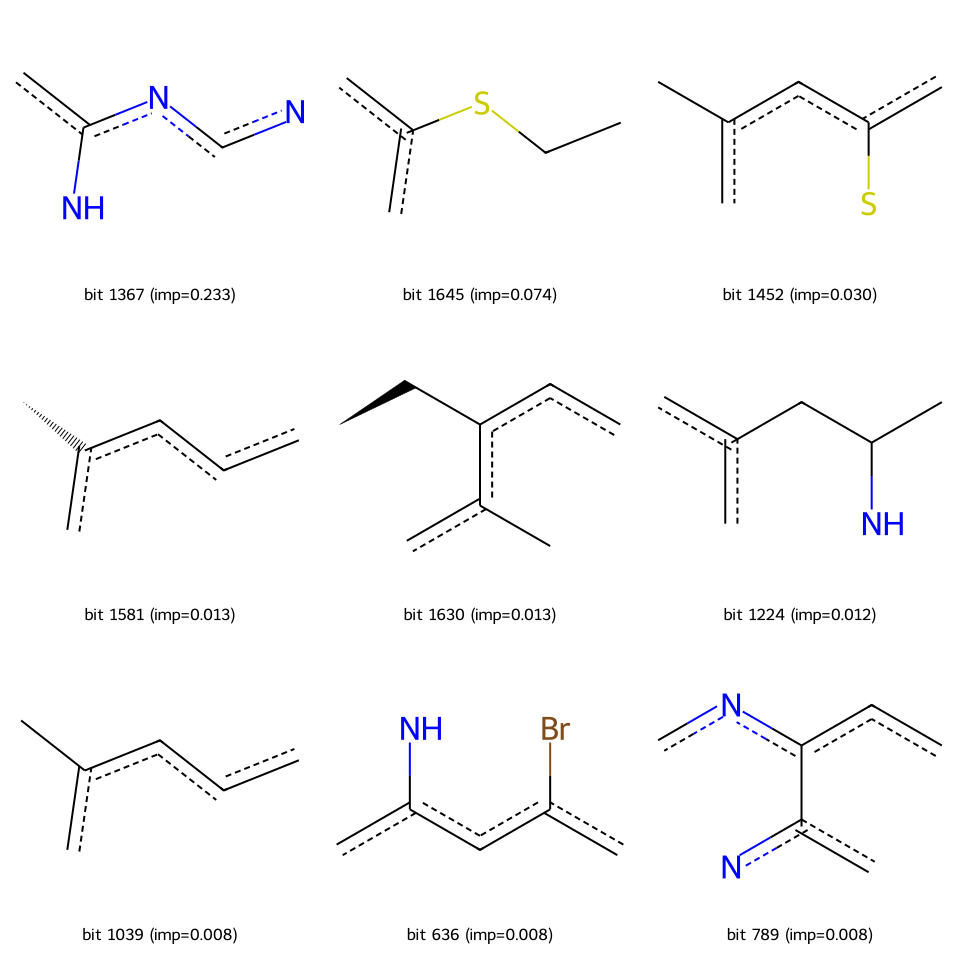

The dominant bit (MDI 0.233, carried by 2762/6165 compounds) decodes to
an **aminopyrimidine** - the classic kinase hinge-binding motif. MDI is
inflated by correlated features, so every importance claim was
cross-checked with **permutation importance on the held-out test set**
(numbers: [methodology](docs/methodology.md)).

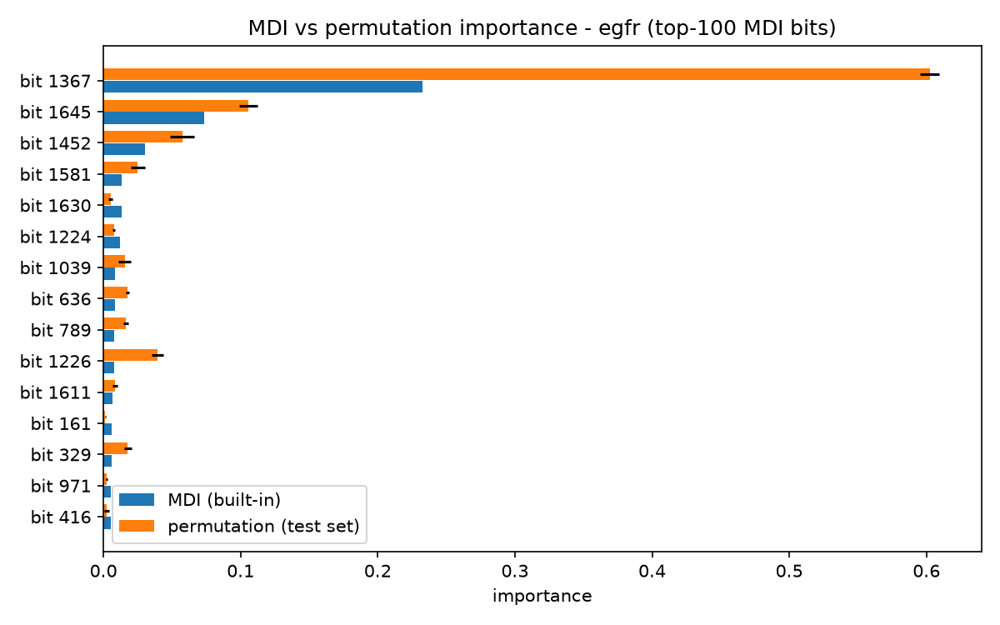

Data QC (ultra-potent audit, censoring, test-set spreads): audited, no
filtering rule - the audit is the deliverable
([methodology](docs/methodology.md)).

**Y-randomization (leakage sanity check).** Trained on permuted labels
every group mean collapses to R² ≤ 0 - individual shuffled GIN seeds can
still land slightly above 0 (`egfr`/random: −0.029/+0.002/+0.011; the
3-seed means stay ≤ 0); the real-label control RF reads
**0.7414** vs the headline **0.7466** (egfr/random). That ~0.005 gap is
the control's training pool, not skipped tuning:
`experiments/y_randomization.py` fits its RF on the GNN train pool
(`egfr`/random 4438 rows), while the headline RF also trained on the 10%
validation carve-out (4932 rows, 494 more) - expected in direction and
magnitude, not leakage evidence. Real and shuffled controls always fit
on the same pool, so the comparison stays valid; the test only asks
shuffled ≤ 0 with the real control inside the baseline band. Details:
[methodology](docs/methodology.md).

## GNN vs traditional QSAR: a controlled comparison

**On the same molecules and the same train/test partitions, does a graph
neural network beat Morgan fingerprints + RandomForest?**

- Same data (cleaned EGFR, 6165, pIC50); same splits regenerated with
  identical code (random_state=42, deterministic scaffolds), **verified
  bit-identically**: saved RF models reproduce the published metrics to
  7 decimals on the regenerated indices (`gnn_01_make_splits.py` aborts
  on mismatch; indices in `data/processed/splits/`).
- The GIN gets a 10% validation carve-out from *train* (seed 42); test
  stays untouched, keeping the comparison paired.
- Molecules are graphs (MoleculeNet/OGB convention); architecture:
  [methodology](docs/methodology.md).

| Split | RF R2 / RMSE | GIN R2 / RMSE (seed 42) | GIN R2 mean +- std (3 seeds) |
|---|---|---|---|
| random | 0.747 / 0.692 | 0.691 / 0.765 | 0.690 +- 0.001 |
| scaffold | 0.562 / 0.950 | 0.544 / 0.969 | 0.526 +- 0.016 |

**On this dataset the GIN does not beat the fingerprint RF.** The random
gap (-0.06 R2) is stable across seeds; the scaffold gap sits within seed
noise (RF ~2 std above the GIN mean). Both lose ~0.2 R2 from random to
scaffold - novel chemotypes are hard for both feature types. Tuning
negatives, error analysis, ESOL: [methodology](docs/methodology.md).

Same test molecules, coloured by scaffold:

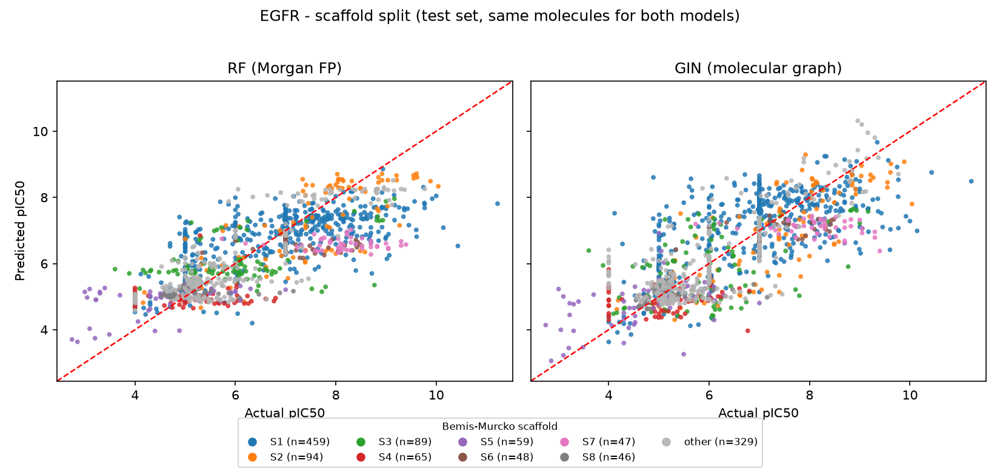

**Do the models fail on the same molecules?** Their worst test
predictions overlap far above chance on both splits: many failures are
**molecule-intrinsic** (noisy or assay-censored measurements), not
model-specific - a data-quality conclusion, not a model-ranking one.
Chemotypes still fail asymmetrically (chromones hurt the GIN,
thienopyrimidines hurt RF; numbers, figure:
[methodology](docs/methodology.md)).

## Cross-target generality & data scaling

**Finding 1 - on random splits the GIN never clearly leads.** Δ(mean) runs
from **+0.000 (tie)** (`herg`) down to −0.058 (`vegfr2`/VEGFR2): 7 of 8
targets are negative and the eighth is a tie. With analogues leaking across the
split, message passing buys nothing over circular substructure
counts on any target in the panel - the EGFR conclusion above is not an
EGFR artefact.

**Finding 2 - on scaffold splits no target gives the GIN a clear lead, and
the deficit's size is a property of the target, not of n.** All eight
Δ(mean) are negative: closest to parity `vegfr2`/VEGFR2 at **−0.006**, worst
`mpro` at **−0.102**, with `abl1` (2,698 compounds) and `herg` (12,019) both
at **−0.013** to three decimals - a 4.5x difference in n and the same
deficit, which is what "Δ does not follow n" looks like. The single-seed
column would have told a different story (two scaffold "wins": `abl1`
+0.030, VEGFR2 +0.028); both flip sign under the 3-seed mean - the
3-seed-mean convention (see [docs/interview.md](docs/interview.md)) - and
under a paired bootstrap the seed-42 convention even calls them
*significant* (`abl1`/scaffold +0.030 [0.002, 0.060], `vegfr2`/scaffold
+0.028 [0.008, 0.047]) while both mean3 CIs straddle zero - and the
scaling verdict below has no measured crossover either. What varies is
the *magnitude*: scaffold diversity and assay structure set how far behind
the GIN falls - the sign never flips.

**Significance, upgraded to bootstrap CIs (P8).** The Δ(mean) statements
above are now backed by a paired bootstrap (B = 10,000; test molecules
resampled with replacement, same indices for both models; CI on the
3-seed-mean prediction). On the 16 random/scaffold cells only **4 have a
95% CI excluding 0 - all four RF wins** (`egfr`/random −0.031,
`egfr_full`/random −0.033, `mpro`/scaffold −0.085, `vegfr2`/random
−0.033); **the GIN wins 0 cells**. The two seed-42 "wins" above are the
counter-example: a single seed can manufacture a significant-looking
lead that disappears under the mean convention. Bond features change
nothing - the full GINE panel is **0 of 10 bootstrapped cells with
CI > 0** (5 cells significantly favour RF; the only positive point
estimate, `herg`/scaffold +0.024, has no CI - fairness-vintage runs kept
no per-seed predictions). Tables
`results/significance/summary.csv`,
`results/significance/summary_gine.csv`,
`results/gine_panel/summary.csv`; forest plots
`figures/significance/ci_panel.png`,
`figures/significance/ci_panel_with_gine.png`,
`figures/gine_panel/panel_dR2.png`. The ±std
columns throughout are auxiliary spread descriptions - the CIs are the
significance statement.

One reading rule for everything above: the panel tables' Δ(mean) and the
bootstrap CI are **two different conventions** - per-seed-mean Δ vs
mean3 *ensemble* Δ (R² of the per-molecule mean prediction) - and the
ensemble side always carries a small non-negative gain, which is why
`egfr`/random is −0.056 in the panel table but −0.031 in the
significance table. Read significance from the CI, point estimates from
the panel, and never compare one against the other; full formulas and
the worked example are in **Panel Δ conventions** in
[methodology](docs/methodology.md).

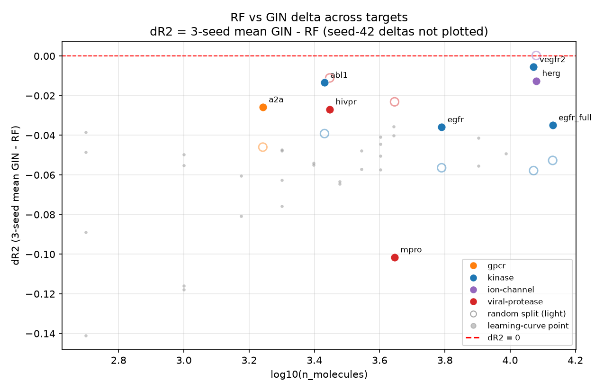

Learning curve (n = 9,717, no crossover), extrapolated n\* with its
weak-identifiability caveat, training-budget caveat, cross-target failure
replication: [methodology](docs/methodology.md).

## Giving the GNN a fair chance (bounded tuning + GINE + AttentiveFP)

Sections above deliberately froze the GIN recipe - every Δ is a
**frozen-recipe** Δ. `experiments/gnn_fairness.py` (36 runs/target) gives
it a bounded chance: on the three nearest-parity targets
(`vegfr2` −0.006, `herg` −0.013, `abl1` −0.013), 8 configs (hidden
{128, 256} x layers {4, 5} x dropout {0.2, 0.3}) train **only on the
scaffold split**, selected by **3-seed mean validation RMSE**, never a
single seed. Winners: `vegfr2` 256/4L/0.2 (0.7056), `herg` 256/5L/0.2
(0.5145), `abl1` 256/4L/0.2 (0.8427) - hidden 256 on all three. A **GINE**
variant adds a `BondEncoder` (`BOND_FEATURE_DIMS = [13, 7, 2]`); all else
is `gnn_03`'s.

Test R2, 3-seed mean ± std; Δ = GIN − RF:

| Target | Model | random R2 | Δ rand | scaffold R2 | Δ scaf |
|---|---|---|---|---|---|
| `vegfr2` (VEGFR2) | RF | 0.736 | — | 0.617 | — |
| | baseline GIN | 0.678±0.007 | −0.058 | 0.611±0.024 | −0.006 |
| | tuned GIN | 0.697±0.006 | −0.039 | 0.622±0.012 | **+0.005** |
| | GINE | 0.674±0.003 | −0.062 | 0.594±0.013 | −0.023 |
| `herg` | RF | 0.615 | — | 0.430 | — |
| | baseline GIN | 0.616±0.017 | +0.000 (tie) | 0.417±0.007 | −0.013 |
| | tuned GIN | 0.612±0.016 | −0.003 | 0.455±0.009 | **+0.025** |
| | GINE | 0.593±0.025 | −0.023 | 0.454±0.007 | **+0.024** |
| `abl1` | RF | 0.792 | — | 0.723 | — |
| | baseline GIN | 0.752±0.006 | −0.039 | 0.710±0.037 | −0.013 |
| | tuned GIN | 0.756±0.014 | −0.035 | 0.693±0.063 | −0.030 |
| | GINE | 0.753±0.007 | −0.039 | 0.638±0.083 | −0.085 |

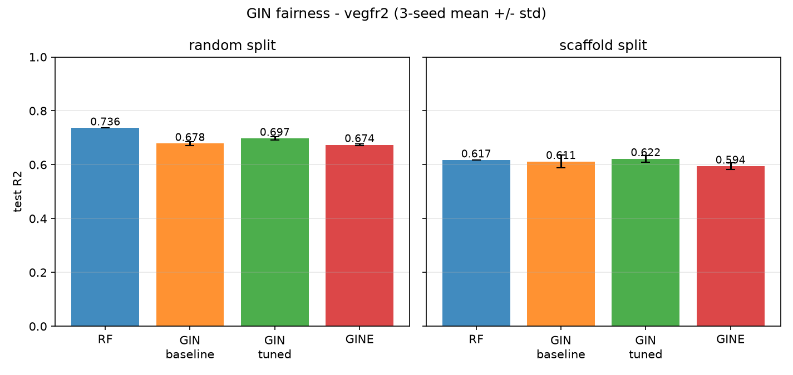
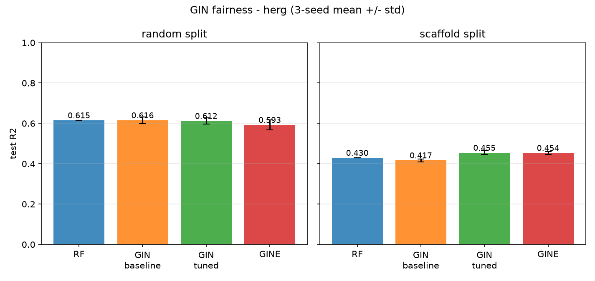
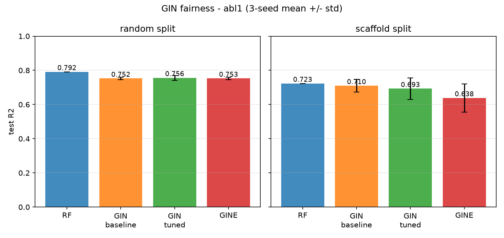

**(i) The frozen recipe really does understate the GIN - but only a
little, and only on scaffold.** 2 of the 3 nearest targets flip positive
on the mean convention (`vegfr2`, `herg`) - the recipe was
capacity-starved. Fragile: `abl1` overfits its **216** validation
molecules (test R2 and seed std both degrade), random flips on none of the three.

**(ii) GINE bond features are not a general gain.** They help only `herg`
scaffold, and hurt `vegfr2` (both splits) and `abl1` scaffold - edge
features are not the missing ingredient. Panel-wide this holds with
bootstrap CIs: across all 8 targets x 2 splits GINE wins **0 of 10
bootstrapped cells** (5 significantly favour RF;
`results/gine_panel/summary.csv`, `figures/gine_panel/panel_dR2.png`,
`figures/significance/ci_panel_with_gine.png`).

**(iii) Boundary, not a reversal.** "No clear lead on any of 16 cells" is
a *frozen-recipe* statement: tuning pushes a minority of near-parity
targets over zero on scaffold and nowhere else, 1 of 3 targets regresses,
and the wins (+0.005 / +0.025) are the size of seed noise.

**AttentiveFP control: attention + GRU + bond features, still no
reversal.** The strongest published small-molecule readout - PyG
AttentiveFP, gated attention with a 30-timestep GRU over the same
atom/bond encoders, frozen recipe otherwise - is the third control: 8
targets x 2 splits x 3 seeds = 48 runs (`experiments/afp_panel.py`,
`--model attentivefp`). Under the mean3 paired bootstrap it wins **1 of
16 cells - `herg`/scaffold +0.013 [+0.035, +0.092]** - while **8 cells
significantly favour RF** and 7 are undecided; on the random split **all
8 Δ are negative** (−0.026 to −0.103). `herg`/scaffold is the one cell
every enhanced variant reads positive on (tuned GIN +0.025, GINE +0.024,
AttentiveFP +0.013) and the first of them to carry it across
significance; the frozen GIN reads −0.013 there. The point (+0.013) and
its CI [+0.035, +0.092] follow the two Δ conventions - per-seed mean vs
mean3 ensemble - defined in **Panel Δ conventions** in
[methodology](docs/methodology.md). Tables
`results/afp_panel/summary.csv`,
`results/significance/summary_attentivefp.csv`; figures
`figures/afp_panel/panel_dR2.png` and the three-model forest plot
`figures/significance/ci_panel_with_afp.png` (gin / gine / afp side by
side). Bond features, bounded tuning and now AttentiveFP have each
failed to flip a single verdict, so "the GIN does not beat the
fingerprint RF" is no longer a complaint about the GIN implementation -
it is a data-scale / signal statement.

## Multi-task pooling: more data does not rescue the GIN

`scripts/gnn_07_multitask.py` tests the industrial setting single-task
runs cannot: pool `egfr_full` + `abl1` + `vegfr2` into **27,992 molecule
rows** (25,143 unique SMILES; **2,525 = 10.0%** appear under more than
one target). Two arms x 3 seeds x 2 splits: **MT-GIN** (shared trunk +
one linear head per target) and **pooled**, a negative control with one
shared head that ignores the task label; per-target splits/statistics.

Test R2, 3-seed mean ± std (Δ = vs the single-task RF):

| Task | Split | ST-RF | ST-GIN | pooled | MT-GIN |
|---|---|---|---|---|---|
| `egfr_full` | random | 0.759 | 0.707±0.006 (−0.053) | 0.535±0.051 (−0.224) | 0.530±0.033 (−0.229) |
| `egfr_full` | scaffold | 0.593 | 0.558±0.010 (−0.035) | 0.451±0.027 (−0.141) | 0.356±0.078 (−0.236) |
| `abl1` | random | 0.792 | 0.752±0.006 (−0.039) | 0.638±0.060 (−0.153) | 0.625±0.035 (−0.167) |
| `abl1` | scaffold | 0.723 | 0.710±0.037 (−0.013) | 0.554±0.072 (−0.169) | 0.614±0.032 (−0.109) |
| `vegfr2` | random | 0.736 | 0.678±0.007 (−0.058) | 0.195±0.023 (−0.541) | 0.554±0.031 (−0.182) |
| `vegfr2` | scaffold | 0.617 | 0.611±0.024 (−0.006) | 0.182±0.160 (−0.435) | 0.538±0.020 (−0.079) |

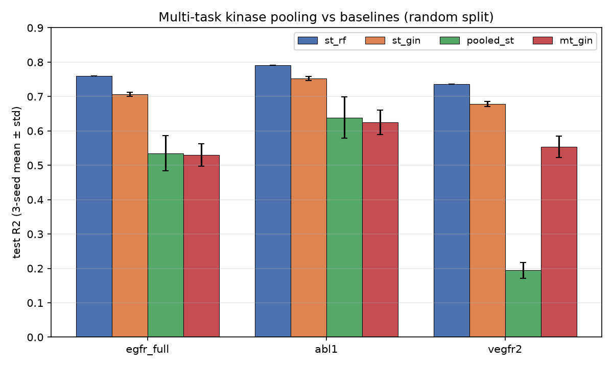
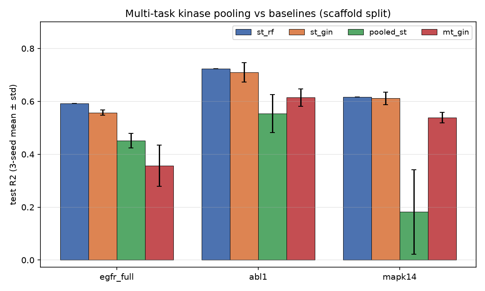

**Pooling loses on every cell.** Neither arm beats the single-task RF in
any of the 6 cells; both are *worse* than single-task GIN everywhere:
MT-GIN trails RF by **−0.079 to −0.236**, pooled by **−0.141 to −0.541**,
vs **−0.006 to −0.058** for single-task GIN. More molecules from more
targets made the model worse, not better. Cross-split leakage can only
*inflate* these numbers; the linear-head handicap does not decide the
verdict - both in [methodology](docs/methodology.md).

## Publication-year time split: the GIN degrades less, neither model holds up

Random and scaffold splits let the model train on molecules published
*after* the molecules it is tested on. The deployment-honest cut
(`scripts/gnn_08_time_splits.py`; a molecule's year = the earliest
publication it appears in, from `data/raw/document_years.csv` - 4,147
ChEMBL documents across the 8 tags) withholds the newest years:
**test = newest publication years cumulating to ~20% of molecules,
valid = newest ~10% of the rest**. Because one recent year can carry a
lot of data, the test fraction runs over target on `a2a` (62%) and
`mpro` (51%) - both datasets end in 2024/2025. RF trained via
`scripts/04_train_and_evaluate.py --split time`, GIN as always
(3 seeds, same npz).

Test R2 (random for reference; GIN = 3-seed mean; GIN ens = R2 of the
3-seed ensemble prediction; Δ = ensemble GIN − RF with paired-bootstrap
95% CI; `results/time_split/summary.csv`):

| Tag | RF rand | GIN rand | RF time | GIN time | GIN ens | Δ time (mean3) [95% CI] |
|---|---|---|---|---|---|---|
| `a2a` | 0.733 | 0.687 | −0.255 | −0.097 | −0.018 | **+0.238** [0.129, 0.347] |
| `abl1` | 0.792 | 0.752 | +0.280 | +0.229 | +0.252 | −0.028 [−0.115, 0.068] |
| `egfr` | 0.747 | 0.690 | +0.013 | +0.037 | +0.071 | **+0.058** [0.005, 0.112] |
| `egfr_full` | 0.759 | 0.707 | −0.891 | −0.240 | −0.215 | **+0.676** [0.617, 0.741] |
| `herg` | 0.615 | 0.616 | −0.034 | −0.076 | +0.042 | **+0.076** [0.034, 0.120] |
| `hivpr` | 0.737 | 0.726 | +0.173 | +0.179 | +0.198 | +0.024 [−0.029, 0.079] |
| `mpro` | 0.730 | 0.707 | −0.051 | +0.057 | +0.092 | **+0.143** [0.112, 0.175] |
| `vegfr2` | 0.736 | 0.678 | +0.093 | +0.020 | +0.080 | −0.013 [−0.045, 0.018] |

Panel means: RF **0.731 (random) → −0.084 (time)**, GIN **0.695 →
+0.014**. Bold = 95% CI excludes 0.

**Reading the Δ column.** Δ and its CI come from the paired bootstrap on
the **3-seed ensemble prediction** (per-molecule mean of the three GIN
runs; the `GIN ens` column is that prediction's R2), not from subtracting
the two displayed columns - ensemble Δ and per-seed-mean Δ are two
different conventions (see **Panel Δ conventions** in
[methodology](docs/methodology.md)) and the ensemble is systematically
≥ the per-seed mean. `herg` is the worked example: GIN time − RF time =
−0.076 − (−0.034) = **−0.042** (GIN looks worse) while the ensemble Δ is
**+0.076** [0.034, 0.120] (GIN significantly better) - opposite signs
from the same three runs.

**The significance pattern flips.** On random/scaffold the 4 significant
cells all belonged to RF (none to the GIN); on time, **5 of 8 cells are
significant and all 5 favour the GIN, 0 favour RF** - the mirror image.
Read what that actually means: under temporal drift the GIN *degrades
significantly less* (relative robustness), but the absolute level is
what a deployment cares about, and there it is bad for both - outside
`abl1` (0.280/0.229) and `hivpr` (0.173/0.179), every value sits between
−0.891 and +0.093; RF is negative on 4 of 8 targets (worst `egfr_full`
**−0.891**, also `herg` −0.034), the GIN on 3 of 8. At R2 ≈ 0 or below,
neither model is usable on future chemistry - the honest industrial
number, and the reason this section reports a flip *and* a failure.
Timelines per target:
`figures/time_split/{tag}_timeline.png`; aggregate:
`figures/time_split/panel_3splits.png`; details:
[methodology](docs/methodology.md).

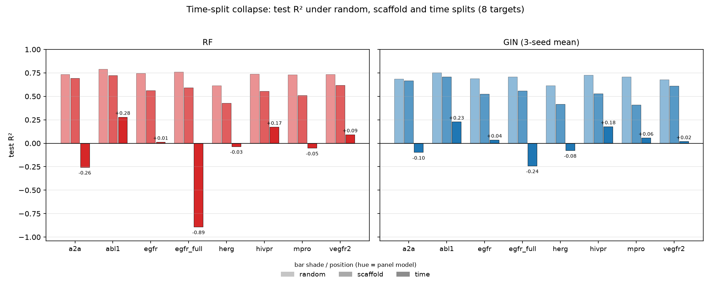

## Uncertainty & applicability domain: RF confidence is usable, GNN confidence is not

`experiments/uncertainty_ad.py` closes the loop from calibrated
uncertainty to an actual screening decision (8 targets x random/scaffold,
RF and GIN, plus the GINE ensemble - 48 result files under
`results/uncertainty/`, figures under `figures/uncertainty/`):

- **RF tree-std calibrates**: 12/16 cells have monotone quintile
  calibration (RMSE rising with predicted std), slope ~0.74,
  Spearman(std, |err|) ~0.45 - usable as a per-molecule confidence.
  The **GNN 3-seed ensemble std does not** (rho ~0.17, slope > 1): the
  seeds are too close to each other to span the error. Any "GNN
  uncertainty" claim in this repo would be noise.
- **AD (max Tanimoto to train ≥ 0.4, coverage ~97%)**: in-AD test R2
  ~0.67 vs out-of-AD ~−0.19 (worst `hivpr`/random −1.36) - out-of-domain
  predictions are indeed bad.
- **The counter-intuitive part**: AD-filtering the screen changes P@100
  by **0.000 in 16/16 cells** - the RF ranking never puts an out-of-AD
  molecule in its top 100; the ranking is itself an implicit AD filter,
  so a second AD pass buys nothing on precision. What does help is
  slicing the report-positive set {pred ≥ 7} to its confident half
  (std ≤ median): precision **0.859 → 0.910** (15/16 cells). And
  confidence must stay a *filter*, not a sort key: re-ranking the
  library by low std first destroys P@100 (**0.563 vs 0.922**).
- Caveat: these conclusions are only as good as the std estimate, so
  they apply to the RF today; the GNN arm has no calibrated std to
  screen with.

## Repository layout

```
qsar-activity-prediction/
├── README.md
├── docs/            # methodology.md (deep detail), interview.md (prep notes)
├── data/            # raw/ (gitignored), processed/ (cleaned, splits/)
├── notebooks/       # qsar_pipeline.ipynb (from scripts/)
├── scripts/         # pipeline (01-07_* QSAR, gnn_* GNN), fetch_artifacts.py
├── figures/         # plots for the results quoted here
├── models/          # trained RandomForests (gitignored)
├── tests/           # pytest suite (CI)
├── results/         # metrics/predictions for both phases
└── pyproject.toml   # tool config
```

## Reproduce

Fast path: top of this README (pretrained `models/` + `data/raw/`,
then Phase 2 from `gnn_01_make_splits.py`). Full retraining - phases 1-3
incl. the 8-target panel - in [methodology](docs/methodology.md).

Docs: [methodology](docs/methodology.md) · [interview
notes](docs/interview.md) · [data provenance](data/README.md).
