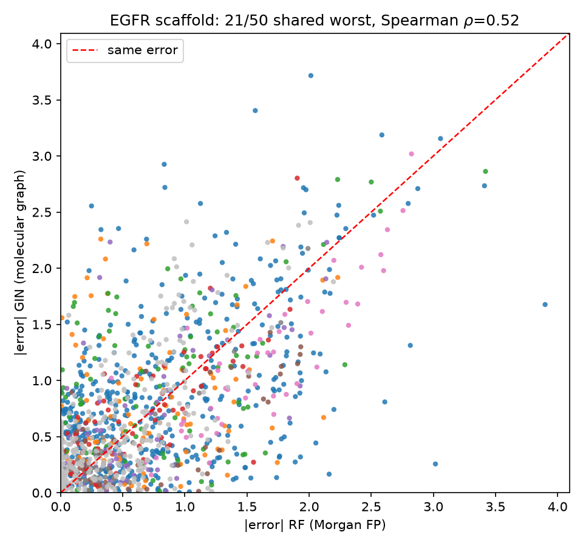
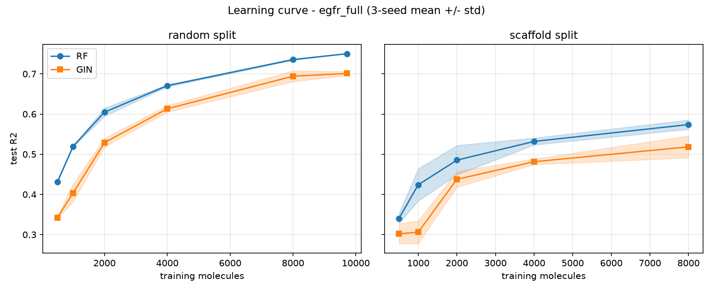

# QSAR Activity Prediction with Machine Learning

Predicting molecular properties from structure, two ways, under identical
train/test conditions:

- **Phase 1 (classic QSAR)**: ChEMBL data -> cleaning -> Morgan
  fingerprints -> RandomForest -> evaluation -> interpretation.
- **Phase 2 (GNN)**: the same molecules as molecular graphs -> GIN
  (Graph Isomorphism Network) -> a controlled RF-vs-GNN comparison
  (section 7), including an error-overlap analysis and a MoleculeNet ESOL
  benchmark run.

## 1. What this project does

Given a compound's structure (SMILES), predict how potently it inhibits the
target (pIC50). This is the computational first stage of **virtual
screening**: rank large virtual libraries in silico before spending wet-lab
budget on the top hits. Phase 2 then asks whether graph neural networks
improve on the classic fingerprint baseline when the comparison is fair.

## 2. Results

EGFR (primary dataset, 6165 unique compounds, test = 20%):

| Split | R2 | RMSE | MAE |
|---|---|---|---|
| random | **0.747** | 0.692 | 0.492 |
| scaffold | **0.562** | 0.950 | 0.708 |

The gap between the two splits is the expected fingerprint of analogue
leakage: a random split lets near-identical compounds land on both sides and
inflates the score; the scaffold split (whole Bemis-Murcko scaffolds held
out) approximates predicting genuinely new chemotypes - the honest number.

Predicted vs actual (EGFR, random split):


Fallback dataset (BACE-1, 1513 compounds):

| Split | R2 | RMSE | MAE |
|---|---|---|---|
| random | 0.646 | 0.792 | 0.572 |
| scaffold | 0.640 | 0.616 | 0.481 |

For BACE the two RMSEs are inverted (random > scaffold) **because the test
sets have different potency spreads** - the random test set is wider
(std 1.33, range 2.7-10.5) than the scaffold one (std 1.03, range 3.9-9.0).
R2 is scale-free, RMSE is not. See `figures/testset_hist_bace.png`.

## 3. Data

Sources, switched via the `QSAR_TAG` environment variable. All ChEMBL
targets come from the same generic downloader
(`scripts/01e_download_chembl.py`, `standard_type=IC50`,
`standard_units=nM`, assay types B/F):

| Dataset tag | Target | ChEMBL id | Unique compounds | Source |
|---|---|---|---|---|
| `egfr` (default) | EGFR | CHEMBL203 | 6165 | ChEMBL REST API (`01d`, early-stopped pull) |
| `egfr_full` | EGFR, full B/F pull | CHEMBL203 | 13497 | ChEMBL REST API (`01e`, `--max-rows 0`) |
| `bace` (fallback) | Beta-secretase 1 | – | 1513 | MoleculeNet BACE |
| `a2a` | A2a adenosine receptor | CHEMBL251 | 1746 | ChEMBL REST API (`01e`) |
| `abl1` | ABL1 tyrosine kinase | CHEMBL1862 | 2698 | ChEMBL REST API (`01e`) |
| `mpro` | Replicase polyprotein 1ab / Mpro | CHEMBL4523582 | 4424 | ChEMBL REST API (`01e`) |
| `hivpr` | HIV-1 protease | CHEMBL243 | 2799 | ChEMBL REST API (`01e`) |
| `herg` | hERG / KCNH2 channel | CHEMBL240 | 12019 | ChEMBL REST API (`01e`) |
| `mapk14` | **VEGFR2 / KDR** (tag is a misnomer) | CHEMBL279 | 11797 | ChEMBL REST API (`01e`) |

Primary data comes from **ChEMBL** (EBI): `standard_type=IC50`,
`standard_units=nM`, binding/functional assays. The original `egfr` pull
used `target_chembl_id=CHEMBL203` via the older
`scripts/01d_download_incremental.py`; while this project was built the
ChEMBL API was intermittently returning HTTP 500 (server-side outage; a
VPN did not help). The downloader therefore retries every page, flushes
each page to disk, and skips poisoned result windows - 8936 rows
survived into 6165 unique compounds. The generic `01e` downloader keeps
that resilience contract for every other target; `egfr_full` is the same
CHEMBL203 query with `--max-rows 0` (no early stop): 24560 raw rows into
13497 unique compounds, and a superset check confirms all 6165 `egfr` v1
compounds are present (median |ΔpIC50| 0.0000). Full per-file provenance
is in `data/README.md`.

Cleaning (`scripts/02_clean_data.py`):
- keep only IC50 reported in **nM** (one unit -> comparable numbers)
- drop rows with missing SMILES/IC50 and non-positive IC50
- IC50 (nM) -> **pIC50 = -log10(IC50 x 1e-9)**; cross-checked against
  ChEMBL's own `pchembl_value` (100% agreement)
- compounds measured multiple times are collapsed to the **median** pIC50

## 4. Method

- **Featurization**: 2048-bit Morgan fingerprints (radius 2) with RDKit.
  Each bit encodes a circular atomic neighbourhood, so similar structures
  yield similar vectors.
- **Model**: `RandomForestRegressor`, tuned with `GridSearchCV` (5-fold CV
  on the training set only): n_estimators x max_depth x min_samples_split.
- **Splits**: random 80/20 (`random_state=42`) and a **scaffold split**
  implemented with RDKit only (no DeepChem dependency).

## 5. Interpretation

EGFR top fingerprint bits mapped back to the substructures that set them
(`scripts/05_explain_bits.py`):


The dominant bit (MDI 0.233, carried by 2762/6165 compounds) decodes to an
**aminopyrimidine** - the classic kinase hinge-binding motif, exactly what a
medicinal chemist would expect for EGFR.

Because RandomForest's built-in (MDI) importance is known to be inflated
for correlated features - and 2048 fingerprint bits contain many chemically
equivalent ones - every importance claim above was cross-checked with
**permutation importance on the held-out test set**
(`scripts/07_qc_checks.py`):

- EGFR: bit 1367 drops test R2 by **0.60** when permuted - the MDI ranking
  *under*casts it. Top-100 MDI-vs-permutation Spearman = 0.664.
- BACE: agreement is weaker (Spearman 0.349). MDI ranks the rare
  fluorinated-aromatic bit 964 first; permutation ranks the broadly carried
  oxygen environment first and bit 964 third - still important, but the
  substructure story must be told at the set level, not as "the one bit".


## 6. Data QC

- **Ultra-potent audit** (pIC50 > 9, i.e. IC50 < 1 nM): EGFR has 326 such
  rows (3.7%), but they spread across many independent assays and documents
  (largest single source: 14%) - consistent with genuinely potent
  inhibitors, not unit mislabels. BACE has 8 rows (0.5%) from a single FRET
  assay, also kept. No filtering rule was needed; the audit itself is the
  deliverable.
- **Inactive-end censoring**: the EGFR scatter plot shows vertical
  striations at low pIC50 (e.g. many compounds pinned at exactly 5.0 =
  IC50 10000 nM) - assay detection limits reporting "inactive above X".
  Known QSAR nuisance, visible in the data.
- **Test-set distributions** are compared before trusting any RMSE
  (see section 2).

## 7. GNN vs traditional QSAR: a controlled comparison

Phase 2 of this project asks a sharper question: **on the same molecules
and the same train/test partitions, does a graph neural network beat
Morgan fingerprints + RandomForest?**

### 7.1 Controlling the comparison

- Same data: the cleaned EGFR set above (6165 compounds, pIC50).
- Same splits: the RF pipeline never saved its split indices, so they
  were regenerated with the identical code (random_state=42; deterministic
  scaffold assignment) and **verified bit-identically**: re-predicting
  with the saved RF models reproduces the published metrics to 7 decimal
  places (`scripts/gnn_01_make_splits.py` aborts if this check fails).
- The GNN additionally gets a 10% validation carve-out from *train*
  (seed 42) for early stopping; test molecules are untouched, so the
  comparison stays paired. All indices are persisted under
  `data/processed/splits/`.
- Molecules are graphs: atoms = nodes (9 categorical features: atomic
  number, chirality, degree, formal charge, num H, radical electrons,
  hybridization, aromaticity, ring membership), bonds = undirected edges
  (bond type, stereo, conjugation) - the MoleculeNet/OGB featurization
  convention (`scripts/gnn_graph_dataset.py`), cached as one CSR-style
  npz (`scripts/gnn_02_build_graphs.py`).

### 7.2 Model

GIN (Graph Isomorphism Network), the canonical MoleculeNet baseline:
AtomEncoder (sum of per-feature embeddings) -> 4 x [GINConv -> BatchNorm
-> ReLU -> dropout, residual] -> global mean pool -> MLP head. PyTorch
Geometric, trained on an Apple M4 (MPS). Bond features are unused (plain
GINConv aggregates node features only); pooling is mean rather than the
paper's sum so prediction scale does not couple to molecule size. Target
standardized with train statistics; metrics reported in original pIC50
units (`scripts/gnn_03_train_gin.py`).

### 7.3 Results

| Split | RF R2 / RMSE | GIN R2 / RMSE (seed 42) | GIN R2 mean +- std (3 seeds) |
|---|---|---|---|
| random | 0.747 / 0.692 | 0.691 / 0.765 | 0.690 +- 0.001 |
| scaffold | 0.562 / 0.950 | 0.544 / 0.969 | 0.526 +- 0.016 |

**On this dataset the GIN does not beat the fingerprint RF.** The random
split gap (-0.06 R2) is stable across seeds; the scaffold gap is small
and within seed noise, with the RF number sitting ~2 std above the GIN
mean. Both models lose ~0.2 R2 from random to scaffold - novel chemotypes
are hard for both feature types.

Predicted vs actual on the identical test molecules, coloured by
Bemis-Murcko scaffold:


### 7.4 Hyperparameters: an honest negative result

A bounded tuning pass (300 epochs + ReduceLROnPlateau, dropout {0.2, 0.3})
improved validation RMSE for one config (0.517 vs 0.533, standardized
units) but **degraded** test R2 (0.525 vs 0.544): with only ~490
validation molecules, best-epoch selection was fitting validation noise.
All three configs land at test R2 0.52-0.54, so the simplest recipe was
kept as the final model rather than reporting a best-of-three test
number. Tuning artifacts are kept as `results/*_tuneA/B.*`.

### 7.5 Error analysis: do the models fail on the same molecules?

`scripts/gnn_05_error_analysis.py`:

- Of each model's 50 worst-predicted test molecules, **25/50 (random) and
  21/50 (scaffold) are shared**, against a random expectation of ~2.
  Per-molecule absolute errors correlate at Spearman ~0.52. Many failures
  are therefore **molecule-intrinsic** (noisy or assay-censored
  measurements, cf. section 6), not model-specific - a data-quality
  conclusion, not a model-ranking one.
- Failure modes still differ by chemotype. On the scaffold test set, a
  chromone series (n=37) costs the GIN 1.12 mean |error| vs RF's 0.64,
  while a thienopyrimidine series (n=47) costs RF 1.60 vs GIN's 1.16 -
  fingerprints and message passing generalize differently across
  scaffold space.



### 7.6 External benchmark: MoleculeNet ESOL

To show the pipeline is not tuned to one in-house dataset, the same GIN
(featurizer, split protocol, hyperparameters) was run on the public ESOL
aqueous-solubility benchmark (1128 molecules, log mol/L):

| Split | GIN R2 / RMSE |
|---|---|
| random | 0.913 / 0.642 |
| scaffold | 0.597 / 1.158 |

The random-split number is in line with published GNN results on ESOL
(random-split RMSE roughly 0.5-0.9 depending on protocol); the scaffold
number is much lower, as expected when whole chemotypes are held out.

## 8. Cross-target generality & data scaling

Sections 1-7 answer the RF-vs-GIN question **on one dataset** (EGFR). Two
questions remain: does the answer survive on other targets, and how much
data would the GIN need to catch up?

**Protocol.** One panel, one code path: `QSAR_TAG` switches the dataset,
`scripts/01e_download_chembl.py` pulls each target from ChEMBL
(`standard_type=IC50`, `standard_units=nM`, assay types B/F), and the
cleaning, Morgan r=2/2048 + grid-tuned RF, split regeneration/verification
(`gnn_01_make_splits.py`, aborts on any metric mismatch) and GIN training
are byte-for-byte the same scripts as sections 2-7. The GIN runs 3 seeds
(42/1/2) on every tag.

### 8.1 The panel

Eight targets, both splits (test R2; GIN = 3-seed mean ± std;
**Δ = 3-seed mean GIN − RF**, the effect size every verdict below is judged
on):

| Tag | Target (ChEMBL id) | Family | n | RF rand | GIN rand | Δ rand (mean) | RF scaf | GIN scaf | Δ scaf (mean) |
|---|---|---|---|---|---|---|---|---|---|
| `a2a` | A2a adenosine receptor (CHEMBL251) | GPCR | 1,746 | 0.733 | 0.687±0.003 | −0.046 | 0.691 | 0.666±0.004 | −0.026 |
| `abl1` | ABL1 tyrosine kinase (CHEMBL1862) | kinase | 2,698 | 0.792 | 0.752±0.006 | −0.039 | 0.723 | 0.710±0.037 | −0.013 |
| `egfr` | EGFR (CHEMBL203) | kinase | 6,165 | 0.747 | 0.690±0.001 | −0.056 | 0.562 | 0.526±0.016 | −0.036 |
| `egfr_full` | EGFR, full B/F pull (CHEMBL203) | kinase | 13,497 | 0.759 | 0.707±0.006 | −0.053 | 0.593 | 0.558±0.010 | −0.035 |
| `herg` | hERG / KCNH2 channel (CHEMBL240) | ion channel | 12,019 | 0.615 | 0.616±0.017 | **+0.000** | 0.430 | 0.417±0.007 | −0.013 |
| `hivpr` | HIV-1 protease (CHEMBL243) | viral protease | 2,799 | 0.737 | 0.726±0.005 | −0.011 | 0.554 | 0.527±0.028 | −0.027 |
| `mapk14` ¹ | **VEGFR2 / KDR** (CHEMBL279) | kinase | 11,797 | 0.736 | 0.678±0.007 | −0.058 | 0.617 | 0.611±0.024 | **−0.006** |
| `mpro` | Replicase polyprotein 1ab / Mpro (CHEMBL4523582) | viral protease | 4,424 | 0.730 | 0.707±0.003 | −0.023 | 0.509 | 0.408±0.022 | **−0.102** |

¹ The tag `mapk14` is a **misnomer**: CHEMBL279 is VEGFR2 (KDR), confirmed
against the ChEMBL target API - every activity row carries
`target_pref_name = "Vascular endothelial growth factor receptor 2"`. The
tag is kept for file-name continuity; read it as VEGFR2 above. BACE is not
in the table because it has the RF baseline only (no GIN run).

All columns are read from `results/multi_target/summary.csv` (generated by
`experiments/multi_target_summary.py` from the per-target
`results/comparison_{tag}.csv`); Δ is the 3-seed mean GIN R2 minus the RF
R2, computed at full precision and only then rounded - the standard
interview talking point 6 already demands for any GNN number.

Reference only - the `d_r2_gin_minus_rf` column shipped inside every
`comparison_{tag}.csv` is **not** that Δ: it is the **seed-42** GIN run
minus RF, and where it diverges from the mean it does so by more than the
effect it purports to report. `abl1` scaffold reads **+0.030** (a "win")
against −0.013 on the mean; `mapk14`/VEGFR2 scaffold **+0.028** against
−0.006; `herg` random **−0.021** against **+0.000**. A single seed carries
±0.02 of spread on the scaffold score, so a ±0.03 "win" read off one seed
is indistinguishable from noise - those numbers appear below only as this
footnote.


**Finding 1 - on random splits the GIN never clearly leads.** Δ(mean)
runs from **+0.0003** (`herg`, a tie to three decimals) down to −0.058
(`mapk14`/VEGFR2): 7 of 8 targets are negative and the eighth is zero.
With analogues free to leak across the split, message passing buys
nothing over circular substructure counts on any target in the panel - the
EGFR conclusion of section 7 is not an EGFR artefact.

**Finding 2 - on scaffold splits no target gives the GIN a clear lead,
and the deficit's size is a property of the target, not of n.** All eight
Δ(mean) are negative: closest to parity `mapk14`/VEGFR2 at **−0.006**,
worst `mpro` at **−0.102**, with `abl1` (2,698 compounds) and `herg`
(12,019) both at **−0.013** to three decimals - a 4.5x difference in n
and the same deficit, which is what "Δ does not follow n" looks like.
The single-seed column would have told a different
story (two scaffold "wins", `abl1` +0.030 and VEGFR2 +0.028); both flip
sign under the 3-seed mean, a live demonstration of talking point 6
standing right next to the scaling verdict of 8.2 - no measured crossover
there either. What genuinely varies across targets is the *magnitude*
(`mpro` −0.102 vs VEGFR2 −0.006): scaffold diversity and assay structure
(censoring, potency spread, replicate density) set how far behind the GIN
falls - but on this panel the sign never flips.

### 8.2 Data scaling: how much more data would it take?

The paired learning curve was extended on `egfr_full` to **n = 9,717** -
the entire random-split training pool - with the test set, validation set
and hyperparameters frozen (`experiments/learning_curve.py`, sizes
500/1000/2000/4000/8000/9717 x seeds 42/1/2):



- **Measured range: no crossover.** At the full-pool point n=9,717
  (random) RF 0.7502 vs GIN 0.7009, gap **−0.049**; the scaffold curve
  stops at n=8,000 with gap −0.055. The gap shrinks from −0.089 at n=500
  but never closes - the curve-level echo of 8.1: no target leads on the
  mean, and no n produces a crossing.
- **Extrapolated crossover: n\* ≈ 25k-35k (≈ 3x current data).** Fitting a
  saturating curve R2(n) = R2_inf − a·n^(−b) and solving the gap for its
  root (`experiments/scaling_analysis.py`) gives n\* = **28,156** on
  random (per-seed **33,522 ± 13,558**, 95% CI **[19,765, 45,215]**,
  3/3 seeds find a root) and n\* = **25,112** on scaffold (only 1/3 seeds
  finds a root, so no CI is available).
- **Weakly identified.** Three of the fits return **R2_inf > 1** (random
  RF 1.19, random GIN 2.37, scaffold GIN 1.88) - an asymptote above a
  perfect R2 is impossible. With only six curve points the asymptote (and
  therefore n\*) is poorly constrained: treat it as an order-of-magnitude
  statement - *roughly three times more data, not a precise threshold*.

**The failures themselves transfer.** `gnn_05_error_analysis.py` on four
targets (worst-50 overlap / Spearman ρ of per-molecule |error|, random /
scaffold): `egfr` 25/21, ρ 0.52/0.52 (chance ≈ 2); `mapk14` 25/30,
ρ 0.49/0.55 (chance ≈ 1); `herg` 32/42, ρ 0.52/0.60 (chance ≈ 1); `a2a`
32/32, ρ 0.63/0.65 (chance ≈ 7). Overlap of 21-42 against an expected 1-7
and ρ 0.49-0.65 across chemically unrelated targets: the conclusion of
section 7.5 - **many failures are molecule-intrinsic (noisy or censored
measurements), not model-specific** - is a cross-target robust result.

## Repository layout

```
qsar-activity-prediction/
├── README.md
├── data/
│   ├── raw/            # downloaded activities (gitignored, see data/README.md)
│   └── processed/      # cleaned pIC50 CSVs, fingerprint/graph npz, splits/
├── notebooks/          # qsar_pipeline.ipynb (auto-generated from scripts/)
├── scripts/            # runnable pipeline, one step per file
│   ├── 01-07_*         # phase 1: ChEMBL -> Morgan FP -> RF (QSAR)
│   └── gnn_*           # phase 2: molecular graphs -> GIN, comparison, ESOL
├── figures/            # scatter plots, substructure grids, QC plots
├── models/             # trained RandomForests (gitignored, large)
└── results/            # metrics/predictions for both phases (gnn_* = phase 2)
```

## Reproduce

```bash
python -m venv .venv && source .venv/bin/activate
pip install -r requirements.txt

# phase 1 - classic QSAR (RF on Morgan fingerprints)
export QSAR_TAG=egfr   # or: bace
python scripts/01d_download_incremental.py     # egfr only
python scripts/02_clean_data.py
python scripts/03_featurize.py
python scripts/04_train_and_evaluate.py
python scripts/05_explain_bits.py
python scripts/07_qc_checks.py

# phase 2 - GNN on molecular graphs, compared against the same splits
python scripts/gnn_01_make_splits.py           # regenerate + VERIFY splits
                                               # (needs models/*.joblib from step 04 -
                                               # RF models are gitignored, 30-180 MB each,
                                               # over GitHub's file limit; run step 04 first)
python scripts/gnn_02_build_graphs.py          # SMILES -> graph cache
python scripts/gnn_03_train_gin.py --split random
python scripts/gnn_03_train_gin.py --split scaffold
python scripts/gnn_04_compare.py               # table + scaffold-coloured scatter
python scripts/gnn_05_error_analysis.py        # shared-failure analysis

# bonus: MoleculeNet ESOL benchmark
python scripts/gnn_06_esol_prep.py
QSAR_TAG=esol python scripts/gnn_03_train_gin.py --split scaffold
QSAR_TAG=esol python scripts/gnn_03_train_gin.py --split random

# phase 3 - cross-target panel + data scaling (section 8); one tag per target
python scripts/01e_download_chembl.py --target-chembl-id CHEMBL251 --tag a2a
QSAR_TAG=a2a python scripts/02_clean_data.py
QSAR_TAG=a2a python scripts/03_featurize.py
QSAR_TAG=a2a python scripts/04_train_and_evaluate.py
QSAR_TAG=a2a python scripts/gnn_01_make_splits.py      # regenerate + VERIFY
QSAR_TAG=a2a python scripts/gnn_02_build_graphs.py
QSAR_TAG=a2a python scripts/gnn_03_train_gin.py --split random             # seed 42
QSAR_TAG=a2a python scripts/gnn_03_train_gin.py --split random  --seed 1 --suffix _seed1
QSAR_TAG=a2a python scripts/gnn_03_train_gin.py --split random  --seed 2 --suffix _seed2
QSAR_TAG=a2a python scripts/gnn_03_train_gin.py --split scaffold           # ...x3, then:
QSAR_TAG=a2a python scripts/gnn_04_compare.py          # results/comparison_a2a.csv
QSAR_TAG=a2a python scripts/gnn_05_error_analysis.py   # shared-failure analysis
python experiments/multi_target_summary.py             # summary.csv + delta_vs_n.png
python experiments/learning_curve.py --tag egfr_full --sizes 500,1000,2000,4000,8000,9717
python experiments/scaling_analysis.py --tag egfr_full # n* + CI, scaling_egfr_full.json/png
```

## Why pIC50?

Raw IC50 spans several orders of magnitude. The heavy tail dominates
least-squares training; pIC50 is roughly normal and is the standard QSAR
target transform.

## Conclusions

Eight experiments, one page. Every number below is 3-seed mean +/- std and
recomputable from `results/` (run ledger: `experiments/LOG.md`).

1. **The GIN does not beat Morgan fingerprints + RF on ~6.2k EGFR
   compounds.** Headline test R2: RF 0.747 random / 0.562 scaffold;
   GIN 3-seed 0.690±0.001 / 0.526±0.016. A negative result, reported
   as such.
2. **Data scaling: RF saturates early; the GIN still climbs at
   n=4400.** On the paired learning curve (n=500-4400), RF is nearly
   flat from small n (0.541 -> 0.741 random, seed-std ~0) while the
   GIN rises steeply (0.400 -> 0.701) without catching up; the
   scaffold gap narrows to 0.036 at the largest n.
3. **The signal is real: Y-randomization kills it.** Training on
   permuted labels scores <= 0 on every run (shuffled-label means
   -0.18 RF / -0.01 GIN, all < 0.2) while real-label controls land
   exactly on the baselines - no train/test leakage.
4. **XGBoost does not beat the tuned RF either** (-0.010 random /
   -0.044 scaffold vs the same-pool RF control, deterministic across
   seeds). Second negative result: on this featurization, boosting
   machinery buys nothing over bagging.
5. **Fingerprint length matters; radius mostly does not.** The
   ablation (r={2,3} x bits={1024,2048}) is flat on random splits
   (spread 0.004) but on scaffold splits the 1024-bit cells drop up
   to 0.032 (r=3/1024); 2048 bits is not dispensable. The headline
   r=2/2048 configuration is confirmed as the anchor (reproduction
   delta <= 0.004 against the headline metrics).
6. **The two architectures attend to different parts of the molecule.**
   On the chemotypes where failures are asymmetric, cross-model
   attention overlap is 0.47 and tracks the asymmetry (chromone 0.40 <
   thienopyrimidine 0.54); bit 1367 - the aminopyrimidine hinge-binding
   motif - sits in the RF top-5 for 10/10 molecules across both
   families; the GIN places 66% of its top atoms on the scaffold core.
7. **Across targets the GIN leads nowhere once GNN numbers are 3-seed
   means; only the size of the deficit is target-dependent (section 8.1).**
   Across 8 targets x 2 splits, Δ(mean) = 3-seed mean GIN − RF is negative
   in **15 of 16 cells** and a tie in the 16th (hERG random **+0.0003**):
   best VEGFR2 scaffold **−0.006**, worst Mpro scaffold **−0.102**, random
   range +0.000 to −0.058. The single-seed `d_r2` column would have shown
   ABL1 and VEGFR2 *winning* scaffold (+0.030 / +0.028); both flip sign
   under the 3-seed mean - talking point 6's seed-noise warning caught in
   the act, and consistent with section 8.2's un-crossed learning curve.
   Magnitude follows the target, not n: ABL1 (2,698 compounds) and hERG
   (12,019) both land at −0.013 to three decimals.
8. **Scaling: no crossover in measured data; the extrapolated n\* is
   weakly identified, but the failure structure is robust (section 8.2).**
   On `egfr_full` the GIN still trails at n=9,717 (random gap −0.049);
   saturating fits put the crossover at n\* ≈ 25k-35k (~3x current data),
   yet three fits return R2_inf > 1, so n\* is an order-of-magnitude
   estimate, not a threshold. Meanwhile the shared-failure analysis
   reproduces on 4 targets (worst-50 overlap 21-42 vs 1-7 expected,
   ρ 0.49-0.65) - "many failures are molecule-intrinsic" holds across
   chemically unrelated targets.

## Interview talking points

1. **Why pIC50** - order-of-magnitude target standardisation.
2. **Why scaffold split** - random splits leak analogues across
   train/test and inflate scores; scaffold splits emulate new-chemotype
   prediction. This project's EGFR numbers show the effect directly
   (0.747 random vs 0.562 scaffold).
3. **Honest importance** - MDI is biased under correlated features; all
   substructure claims were validated with permutation importance on the
   held-out set before being made.
4. **Industry use** - first stage of virtual screening: in silico triage of
   large libraries before experimental validation, cutting wet-lab cost by
   orders of magnitude.
5. **Controlled GNN vs RF comparison** - same molecules, splits verified
   bit-identical (saved RF models reproduce the original metrics to 7
   decimals on the regenerated indices). Result: the GIN does *not* beat
   fingerprints here - on ~4.4k training molecules, message passing buys
   nothing over circular substructure counts, and both drop ~0.2 R2 on
   novel scaffolds.
6. **Negative results reported** - a scheduler/dropout tuning pass
   improved validation but degraded test (validation-set selection noise);
   the simplest recipe was kept. GIN scaffold-split R2 varies +-0.02
   across seeds - single-seed GNN comparisons are meaningless.
7. **Failure-mode analysis** - the two models' 50 worst molecules overlap
   ~10-12x more than chance (25 random / 21 scaffold shared, vs ~2 expected;
   Spearman ~0.52): many failures are
   molecule-intrinsic (assay censoring/noise), yet specific chemotypes
   fail asymmetrically (chromones hurt the GIN more, thienopyrimidines
   hurt RF more) - fingerprints and graphs extrapolate differently.
