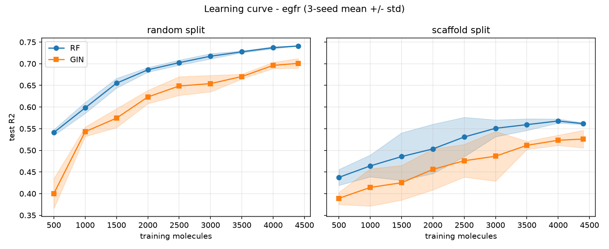
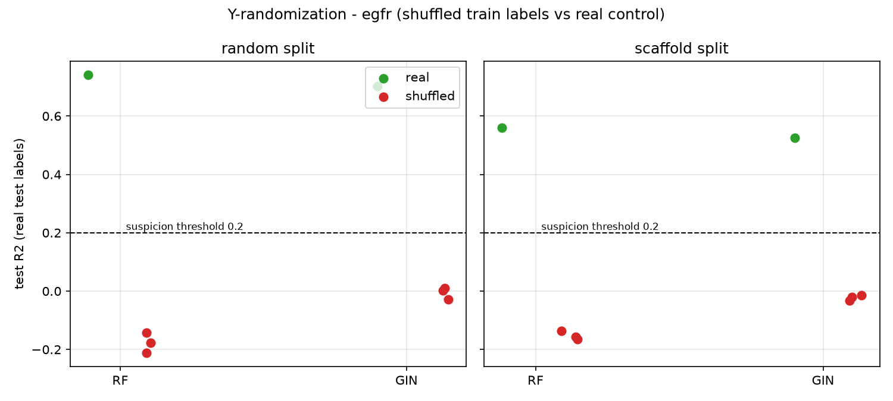
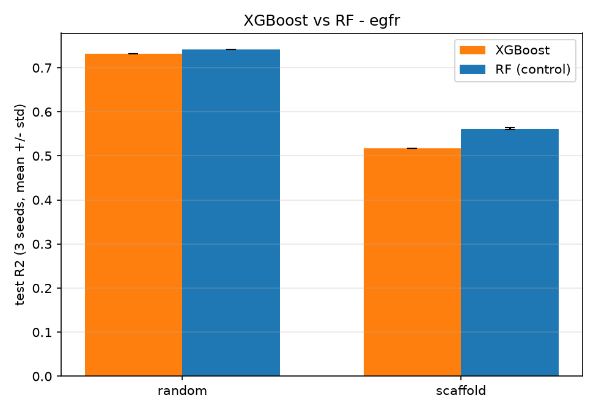
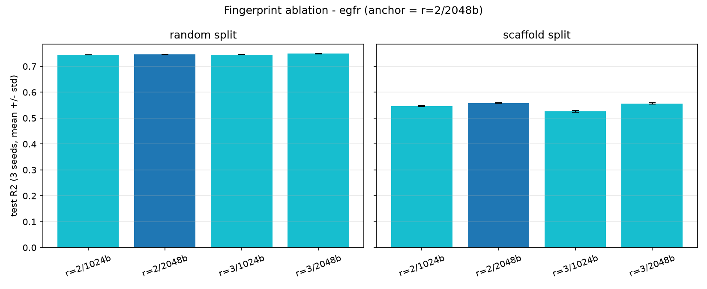

# Methodology & supplementary results

Deep technical companion to the top-level [`README.md`](../README.md).
Everything here was moved out of the README verbatim during the docs
slimming pass: no number, caveat or conclusion was altered. The interview
prep material lives separately in [`docs/interview.md`](interview.md),
and every experiment is recomputable from `results/` (run ledger:
`experiments/LOG.md`).

## Data QC

The audit deliverables behind the README's short QC note:

- **Ultra-potent audit** (pIC50 > 9, i.e. IC50 < 1 nM): EGFR has 326 such
  rows (3.7%), but they spread across many independent assays and documents
  (largest single source: 14%) - consistent with genuinely potent
  inhibitors, not unit mislabels. BACE has 8 rows (0.5%) from a single FRET
  assay, also kept. No filtering rule was needed; the audit itself is the
  deliverable.
- **Inactive-end censoring**: the EGFR scatter plot shows vertical
  striations at low pIC50 (e.g. many compounds pinned at exactly 5.0 =
  IC50 10000 nM) - assay detection limits reporting "inactive above X".
  Known QSAR nuisance, visible in the data.
- **Test-set distributions** are compared before trusting any RMSE
  (see the BACE fallback results in the README, and
  `figures/testset_hist_bace.png` / `figures/testset_hist_egfr.png` /
  `figures/testset_hist_vegfr2.png`).

## Feature-importance checks (README "Interpretation & data QC")

Because RandomForest's built-in (MDI) importance is known to be inflated
for correlated features - and 2048 fingerprint bits contain many
chemically equivalent ones - every importance claim was cross-checked with
**permutation importance on the held-out test set**
(`scripts/07_qc_checks.py`):

- EGFR: bit 1367 drops test R2 by **0.60** when permuted - the MDI ranking
  *under*-casts it. Top-100 MDI-vs-permutation Spearman = 0.664.
- BACE: agreement is weaker (Spearman 0.349). MDI ranks the rare
  fluorinated-aromatic bit 964 first; permutation ranks the broadly carried
  oxygen environment first and bit 964 third - still important, but the
  substructure story must be told at the set level, not as "the one bit".

## Panel Δ conventions

Every Δ (GIN − RF) in this repo is reported under one of two
conventions. Both are computed from the same 3 seed predictions on the
same test molecules, but they are **different functionals of those
predictions**, so a point estimate and a confidence interval can
legitimately disagree. Never mix them in one comparison.

**1. per-seed-mean Δ - the panel point estimate.**

`Δ_panel = mean_s R2(y_test, ŷ_s) − R2(y_test, ŷ_RF)`

Each seed's test R2 is scored on its own, the 3 R2s are averaged, then
the RF test R2 is subtracted. This is every Δ printed next to a ±std in
the README and the panel tables: the `d_*_mean_*` columns of the
per-target `results/comparison_{tag}.csv` (rolled up by
`experiments/multi_target_summary.py` into the `d_r2_* (mean)` columns
of `results/multi_target/summary.csv`), and the `d_r2_mean` column of
`results/gine_panel/summary.csv` / `results/afp_panel/summary.csv`.
Computed at full precision; rounding happens only for display.

**2. ensemble Δ (mean3) - the significance estimate.**

`Δ_ens = R2(y_test, mean_s ŷ_s) − R2(y_test, ŷ_RF)`

The 3 seed predictions are averaged **per molecule** first, one R2 is
computed from that ensemble prediction (the deployable "3-seed
ensemble" model), and only then is the RF R2 subtracted. This is the
`pair=mean3` row of every `results/significance/summary*.csv` (columns
`d_r2`, `ci_lo/ci_hi`, `frac_boot_gin_better`; csv files written before
the 2026-10-10 rename still say `p_one_sided`), the `ci_lo/ci_hi`
whiskers drawn over the panel `d_r2_mean` bars, and the `d_r2_mean3` +
`ci_lo/ci_hi` columns of `results/time_split/summary.csv` (the same
numbers as the `mean3` rows of
`results/significance/summary_time.csv`).

**Why the two differ, systematically.** Averaging predictions before
scoring cancels per-molecule seed variance while the denominator SST is
unchanged, so:

`R2(ensemble) − mean_s R2(seed_s) = Σ_m var_s(ŷ_m,s) / SST ≥ 0`

(the numerator sums over the n test molecules; equivalently
`mean_m var_s(ŷ_m,s) / (SST/n)`, the mean variance over the mean square).

The **ensemble gain is never negative**: for any cell
Δ_ens ≥ Δ_panel (same RF reference), with equality only when the 3
seeds agree exactly. The offset grows with seed spread - it is a
property of the convention, not a bug or a data problem.

**Worked example (`egfr`/random).** The panel table and
`results/comparison_egfr.csv` read **−0.056** (per-seed-mean); the
`mean3` row of `results/significance/egfr_random.csv` reads **−0.031**
[−0.054, −0.008] (ensemble). The ~0.025 offset is pure ensemble gain -
two right answers to two different questions ("how far are the
individual seeds from RF" vs "how far is the deployed ensemble from
RF"), not a discrepancy.

**Reading rule.** Significance (is this cell separable from 0?) - read
the CI from the significance tables (`frac_boot_gin_better` there is the
fraction of bootstrap replicates favouring GIN, a direction descriptor,
not a hypothesis-test p). Point estimates, ±std and panel
bars - read the panel tables. Never compare a panel point against an
ensemble CI: `afp_panel`'s `herg`/scaffold is the illustration - its
point reads **+0.013** (per-seed-mean) while its own ensemble CI is
**[+0.035, +0.092]**, so the point sits outside "its own" interval
purely because of the convention difference (`experiments/afp_panel.py`
documents both). One more reference column: `d_*_seed42_*` is the
single-seed convention, reference only - one seed carries ±0.02 of
spread on the scaffold score, so a ±0.03 single-seed "win" is
indistinguishable from noise. Whether any given Δ is separable from
resampling noise is answered solely by the paired bootstrap under
"Statistical significance" below.

## GNN model & graph featurization

Featurization (README "Controlling the comparison"): molecules are graphs:
atoms = nodes (9 categorical features: atomic number, chirality, degree,
formal charge, num H, radical electrons, hybridization, aromaticity, ring
membership), bonds = undirected edges (bond type, stereo, conjugation) -
the MoleculeNet/OGB featurization convention (`scripts/gnn_graph_dataset.py`),
cached as one CSR-style npz (`scripts/gnn_02_build_graphs.py`).

Model: GIN (Graph Isomorphism Network), the canonical MoleculeNet baseline:
AtomEncoder (sum of per-feature embeddings) -> 4 x [GINConv -> BatchNorm
-> ReLU -> dropout, residual] -> global mean pool -> MLP head. PyTorch
Geometric, trained on an Apple M4 (MPS). The default `gin` does not use
bond features (plain GINConv aggregates node features only), but the
cached 3-dim bond features are no longer "stored but unused":
`scripts/gnn_03_train_gin.py --model {gin, gine, attentivefp}` - all three
choices are live and were run panel-wide - builds the baseline **GIN**
(byte-for-byte the original recipe, artifacts keep their old names),
**GINE** (same shell; `GINEConv` consumes `BondEncoder(data.edge_attr)`,
`BOND_FEATURE_DIMS = [13, 7, 2]`), or PyG **AttentiveFP**. AttentiveFP
keeps the same two embedding front-ends (`AtomEncoder` -> in_channels,
`BondEncoder` -> edge_dim) and then runs the raw PyG model as-is:
`AttentiveFP(in_channels=hidden, hidden_channels=hidden, out_channels=1,
edge_dim=hidden, num_layers=4, num_timesteps=30, dropout=dropout)` -
gated atom/bond attention with a GRU readout over 30 timesteps, no
residual/BatchNorm shell of its own; hidden 128, 4 layers, dropout 0.2,
100 epochs, early stopping on validation RMSE - everything else is the
frozen `gnn_03` recipe. The P8 GINE panel (Statistical significance
below) runs the `gine` variant across all 8 targets - bond features are
used, and they still do not flip the verdict. P8 phase 3 runs the
`attentivefp` variant the same way (8 targets x 2 splits x 3 seeds = 48
runs; `results/afp_panel/summary.csv`) and it wins 1 of 16 cells.
Pooling is mean rather than the paper's sum so prediction scale
does not couple to molecule size. Target standardized with train
statistics; metrics reported in original pIC50 units.

**RF hyperparameter search.** `scripts/04_train_and_evaluate.py` tunes
n_estimators x max_depth x min_samples_split with `GridSearchCV` on the
training pool only, using `KFold(5, shuffle=True, random_state=42)`.
The shuffle is deliberate: scaffold and time train pools are ordered by
scaffold group / SMILES, so unshuffled folds would each be one block of
the same chemotype family (or one alphabetical SMILES run) and the grid
winner would be picked on folds that never see some families. The test
set plays no role in the search.

## Statistical significance (paired bootstrap)

`experiments/paired_bootstrap.py` decides whether any single cell's Δ is
separable from resampling noise - analysis only, nothing is retrained:

- **Method**: B = **10,000** bootstrap replicates; test **molecules**
  resampled with replacement, *paired* - one index matrix applied to both
  models' predictions (test-index alignment asserted, never assumed).
  Every cell is evaluated under two conventions: `seed42` (seed-42 GIN vs
  RF, reference) and `mean3` (primary: per-molecule mean of the 3 GIN
  seed predictions vs RF, matching the campaign's mean convention). The
  95% CI is the [2.5, 97.5] percentile of the bootstrap ΔR2
  distribution; `frac_boot_gin_better = #(ΔR2_boot > 0)/B` - the
  fraction of bootstrap replicates favouring GIN, **not a p-value**
  (renamed from `p_one_sided` on 2026-10-10; a strong GIN win reads
  ≈1.0, so filtering on `p < 0.05` would silently drop every GIN win);
  a cell is *significant* iff the CI excludes 0. Signs: ΔR2 = R2_GIN − R2_RF (> 0
  favours GIN); ΔRMSE = RMSE_GIN − RMSE_RF (> 0 favours RF). Both
  conventions of a cell draw from the same seeded generator (seed 42, so
  runs are order-independent).
- **Results (random/scaffold, gin, 16 cells)** - under `mean3`, only 4
  cells have a CI excluding 0, **all four favour RF**; GIN wins 0:

  | cell | ΔR2 (mean3) | 95% CI | winner |
  |---|---|---|---|
  | `egfr`/random | −0.031 | [−0.054, −0.008] | RF |
  | `egfr_full`/random | −0.033 | [−0.048, −0.018] | RF |
  | `mpro`/scaffold | −0.085 | [−0.132, −0.041] | RF |
  | `vegfr2`/random | −0.033 | [−0.053, −0.015] | RF |

  Under `seed42` two cells instead read as *GIN* wins -
  `abl1`/scaffold +0.030 [0.002, 0.060] and `vegfr2`/scaffold +0.028
  [0.008, 0.047] - both of which vanish under `mean3`. This is the
  single-seed-is-noise convention (Panel Δ conventions above) promoted
  from a heuristic to a bootstrap result: a lone seed can manufacture a
  "significant" lead.
- **GINE** (`--model gine`, `results/significance/summary_gine.csv`):
  10 of 16 cells have a CI (5 tags x 2 splits with per-seed predictions;
  `abl1`/`herg`/`vegfr2` reuse the fairness runs - point estimates only,
  see `results/gine_panel/summary.csv`); **0 cells have CI > 0**, 5
  significantly favour RF (egfr/random, egfr_full both splits,
  hivpr/scaffold −0.118, mpro/scaffold −0.098). Only positive point
  estimate: `herg`/scaffold +0.024, no CI.
- **AttentiveFP** (`--model attentivefp`, P8 phase 3): all 16 cells have a
  CI - 8 significantly favour RF, **1 favours AttentiveFP**
  (`herg`/scaffold +0.013 [+0.035, +0.092]), 7 contain 0; summary in
  `results/significance/summary_attentivefp.csv` (details: the
  "AttentiveFP control" write-up under supplementary experiments).
- **Outputs**: `results/significance/summary.csv`,
  `results/significance/summary_gine.csv`,
  `results/significance/summary_time.csv`,
  `results/significance/summary_attentivefp.csv`, per-cell
  `results/significance/{tag}_{split}{,_gine,_attentivefp}.csv`; forest
  plots `figures/significance/ci_panel.png` (+ `_gine` / `_time` /
  `_with_gine` / `_attentivefp` / `_with_afp` variants). The time-split
  run flips the pattern - see the next section.

## Scaffold split convention: largest groups go to *test* (opposite of DeepChem)

Every split in the repo comes from `scaffold_split()`
(`scripts/qsar_common.py`, the single source of truth shared by phase 1,
phase 2 and the experiments):

- **Our rule**: group molecules by Bemis-Murcko scaffold (RDKit, no
  chirality; a molecule whose SMILES fails to parse forms its own
  group), sort the groups **largest first**, and fill the **test** set
  from the largest groups until it reaches ~20% of the data; everything
  left over goes to train.
- **DeepChem / MoleculeNet's `ScaffoldSplitter` does the reverse**: the
  largest scaffold groups are assigned to **train** first, and test/valid
  get whatever small groups are left over.
- **Direction of the difference**: with our rule the test set contains
  the dominant chemotype families, whose members resemble one another,
  so molecules are scored against their own big family - scaffold scores
  here are **slightly optimistic** relative to a DeepChem-style split,
  and **absolute scaffold R2 values are not comparable across the two
  implementations**. The qualitative conclusions do not depend on it:
  random and scaffold both read GIN ≤ RF throughout this panel either
  way (the convention moves magnitudes, not verdicts).
- **Why this direction was chosen, and the cost**: keeping the large
  families in test is what makes chemotype-level error analysis possible
  - the scaffold-coloured scatters and the chromone/thienopyrimidine
  series findings (`scripts/gnn_05_error_analysis.py`) need whole
  families present in the test set. The cost is explicit: campaigns
  already run are not redone under the other convention, and switching
  to a MoleculeNet-aligned split later would require full retraining of
  every cell.

## Publication-year (time) split

Random/scaffold splits let the model train on molecules published after
the molecules it is tested on; the time split cuts on publication year so
only already-known chemistry predicts genuinely newer compounds.

- **Year source**: `scripts/fetch_document_years.py` probes the ChEMBL
  activity API per `document_chembl_id` and writes
  `data/raw/document_years.csv` - **4,147 documents** across the 8 tags,
  deduplicated (3 documents have no year in ChEMBL at all and are listed
  as failures rather than aborted on).
- **Split rule** (`scripts/gnn_08_time_splits.py`): a molecule's year is
  the **min** document_year over all its activity rows - the earliest
  publication in which it was measured ("first report"); rows with no
  year are ignored. **test** = newest years counted down until the
  cumulative molecule count reaches **>= ~20%**; **valid** = the same
  procedure inside the remaining pool at **10%**, i.e. the newest slice
  of the pre-test years (train's tail); **train** = everything else,
  verified disjoint and exhaustive. Because a single recent year can
  exceed 20% on its own, `test_frac` runs over target where the data
  ends recently: **a2a 62%** (test 2022-2025) and **mpro 51%**
  (2024-2025); the other six land at 0.22-0.26. NA guards write a
  `{TAG}_time_NA.json` marker instead of a split (and consumers skip the
  tag) when the year span < 8 years, the busiest year holds < 100
  molecules, or dated-SMILES coverage falls below 95% (95-99% pins
  undated molecules to the train side).
- **Training**: RF via `scripts/04_train_and_evaluate.py --split time`,
  GIN unchanged (`gnn_03` reads the same `{TAG}_time.npz`; 3 seeds).
- **Results** (`results/time_split/summary.csv`, table in README
  "Publication-year time split"): panel means RF **0.731 (random) ->
  −0.084 (time)**, GIN **0.695 -> +0.014**; worst cell `egfr_full` RF
  **−0.891** (GIN −0.240), `herg` RF −0.034. Significance flips: on
  random/scaffold the significant cells all favour RF (4/16), on time
  **5/8 cells are significant and all favour GIN, 0 favour RF** -
  egfr_full +0.676 [0.617, 0.741], a2a +0.238 [0.129, 0.347], mpro
  +0.143 [0.112, 0.175], herg +0.076 [0.034, 0.120], egfr +0.058
  [0.005, 0.112]. These Δ and CIs are ensemble (mean3) quantities, not
  the difference of the per-seed-mean columns displayed next to them -
  the README table carries a `GIN ens` column and a worked `herg`
  example (columns subtract to −0.042, ensemble Δ is +0.076).
- **Reading**: the GIN *degrades significantly less* under temporal
  drift - relative robustness, which is what the flipped significance
  table measures. Absolute performance is the deployment criterion, and
  there both fail: outside `abl1` (0.280/0.229) and `hivpr`
  (0.173/0.179), every cell sits between −0.891 and +0.093. Two models
  at R2 <= 0 are not a model selection problem - the honest number is
  that neither is deployable on future chemistry at this data size.
  Artifacts: `figures/time_split/panel_3splits.png`,
  `figures/time_split/{tag}_timeline.png` (per-target year histograms
  with both cutoffs), `figures/pred_vs_actual_time_{tag}.png`.

## Uncertainty & applicability domain

`experiments/uncertainty_ad.py` (run twice - `--model gin` and
`--model gine`) asks three questions per cell (8 targets x
random/scaffold): can the model say how wrong it might be, is it right
inside its applicability domain, and does either fact improve a virtual
screen?

- **Uncertainty route 1 - RF tree-std: usable.** Per-molecule std across
  the forest's trees, checked by quintile calibration (5 bins, RMSE vs
  mean std): monotone in **12/16 cells**, slope **~0.74**, Spearman(std,
  |error|) **~0.45**. Good enough to rank molecules by confidence.
- **Uncertainty route 2 - GNN 3-seed ensemble: not usable.** Std across
  the 3 seed predictions correlates with |error| at rho **~0.17** with
  calibration slope **> 1** - the seeds are far too close to each other
  (std median ~0.1 pIC50, 0.07-0.18 across cells) to track errors that
  run ~0.5-1.0 pIC50. A deep-ensemble-style confidence from 3 seeds does
  not exist here; any downstream filter built on it would be noise.
- **AD**: max Morgan Tanimoto to the training set, threshold **0.4**
  (coverage **~97%** of test molecules). In-AD test R2 **~0.67** vs
  out-of-AD **~−0.19** (worst cell `hivpr`/random **−1.36**; 13 cells
  have scorable out-of-AD points) - predictions outside the domain are
  genuinely bad.
- **Screening loop (the counter-intuitive part)**: ranking the test
  library by RF prediction and cutting the top 100, an explicit AD filter
  (sim >= 0.4) changes precision **by 0.000 in 16/16 cells** - no
  out-of-AD molecule ever reaches the RF's top 100, i.e. **the ranking
  itself is an implicit AD filter**; adding a second one buys nothing.
  Confidence works as a *slice*, not a sort: taking the report-positive
  set {pred >= 7} and keeping only its confident half (std <= median)
  lifts precision **0.859 -> 0.910** (15/16 cells), while re-ranking the
  whole library by ascending std collapses P@100 to **0.563 vs 0.922**
  for the prediction ranking - low-std-first surfaces easy inactives,
  not potent hits.
- **Artifacts**: `results/uncertainty/` (per-tag `summary_*.json` +
  per-cell `{tag}_{split}{,_gine}.csv`), `figures/uncertainty/` (68
  figures: 32 calibration, 32 AD-error scatters, 4 screening panels -
  gin and gine), screening panel figures
  `figures/uncertainty/vs_screen_panel_{random,scaffold}{,_gine}.png`.

## Hyperparameters: an honest negative result

A bounded tuning pass (300 epochs + ReduceLROnPlateau, dropout {0.2, 0.3})
improved validation RMSE for one config (0.517 vs 0.533, standardized
units) but **degraded** test R2 (0.525 vs 0.544): with only ~490
validation molecules, best-epoch selection was fitting validation noise.
All three configs land at test R2 0.52-0.54, so the simplest recipe was
kept as the final model rather than reporting a best-of-three test
number. Tuning artifacts are kept as `results/*_tuneA/B.*`.

## Error analysis: do the models fail on the same molecules?

`scripts/gnn_05_error_analysis.py`:

- Of each model's 50 worst-predicted test molecules, **25/50 (random) and
  21/50 (scaffold) are shared**, against a random expectation of ~2.
  Per-molecule absolute errors correlate at Spearman ~0.52. Many failures
  are therefore **molecule-intrinsic** (noisy or assay-censored
  measurements, cf. Data QC above), not model-specific - a data-quality
  conclusion, not a model-ranking one.
- Failure modes still differ by chemotype. On the scaffold test set, a
  chromone series (n=37) costs the GIN 1.12 mean |error| vs RF's 0.64,
  while a thienopyrimidine series (n=47) costs RF 1.60 vs GIN's 1.16 -
  fingerprints and message passing generalize differently across
  scaffold space.


## External benchmark: MoleculeNet ESOL

To show the pipeline is not tuned to one in-house dataset, the same GIN
(featurizer, split protocol, hyperparameters) was run on the public ESOL
aqueous-solubility benchmark (1128 molecules, log mol/L):

| Split | GIN R2 / RMSE |
|---|---|
| random | 0.913 / 0.642 |
| scaffold | 0.597 / 1.158 |

The random-split number is in line with published GNN results on ESOL
(random-split RMSE roughly 0.5-0.9 depending on protocol); the scaffold
number is much lower, as expected when whole chemotypes are held out.

## Data scaling: how much more data would it take?

The paired learning curve was extended on `egfr_full` to **n = 9,717** -
the entire random-split training pool - with the test set, validation set
and hyperparameters frozen (`experiments/learning_curve.py`, sizes
500/1000/2000/4000/8000/9717 x seeds 42/1/2):


- **Measured range: no crossover.** At the full-pool point n=9,717
  (random) RF 0.7502 vs GIN 0.7009, gap **−0.049**; the scaffold curve
  stops at n=8,000 with gap −0.055. The gap shrinks from −0.089 at n=500
  but never closes - the curve-level echo of the eight-target panel: no
  target leads on the mean, and no n produces a crossing.
- **Extrapolated crossover: n\* ≈ 25k-35k (≈ 3x current data).** Fitting a
  saturating curve R2(n) = R2_inf − a·n^(−b) and solving the gap for its
  root (`experiments/scaling_analysis.py`) gives n\* = **28,156** on
  random (per-seed **33,522 ± 13,558**, 95% CI **[19,765, 45,215]**,
  3/3 seeds find a root) and n\* = **25,112** on scaffold (only 1/3 seeds
  finds a root, so no CI is available).
- **Weakly identified.** Three of the fits return **R2_inf > 1** (random
  RF 1.19, random GIN 2.37, scaffold GIN 1.88) - an asymptote above a
  perfect R2 is impossible. With only six curve points the asymptote (and
  therefore n\*) is poorly constrained: treat it as an order-of-magnitude
  statement - *roughly three times more data, not a precise threshold*.

**Training-budget caveat.** All six baseline full-pool runs sit against
the 100-epoch cap (`best_epoch` 93-100), so the same six were re-run at
`--epochs 300` on identical data, splits and seeds: every run then
early-stopped later (epochs 100-217; 5/6 now past the old cap), yet the
3-seed means moved by only **|Δ| ≤ 0.0173** - 7% of the random gap, 31% of
the scaffold gap, and *smaller than the 0.0277 drift between two runs of
the same seed*. Budget effect and run noise are therefore not separable in
a single pass, and either stays well under the RF−GIN gap: the conclusions
above are robust to training budget. Full record:
`results/learning_curve/ep300_confirmation.md`.

**The failures themselves transfer.** `gnn_05_error_analysis.py` on four
targets (worst-50 overlap / Spearman ρ of per-molecule |error|, random /
scaffold): `egfr` 25/21, ρ 0.52/0.52 (chance ≈ 2); `vegfr2` 25/30,
ρ 0.49/0.55 (chance ≈ 1); `herg` 32/42, ρ 0.52/0.60 (chance ≈ 1); `a2a`
32/32, ρ 0.63/0.65 (chance ≈ 7). Overlap of 21-42 against an expected 1-7
and ρ 0.49-0.65 across chemically unrelated targets: the conclusion of
the error analysis above - **many failures are molecule-intrinsic (noisy
or censored measurements), not model-specific** - is a cross-target
robust result.

## Supplementary experiment write-ups

Every number below is 3-seed mean +/- std and recomputable from
`results/` (run ledger: `experiments/LOG.md`).

**Data scaling: RF saturates early; the GIN still climbs at n=4400.**
On the paired learning curve (n=500-4400), RF is nearly flat from small n
(0.541 -> 0.741 random, seed-std ~0) while the GIN rises steeply
(0.400 -> 0.701) without catching up; the scaffold gap narrows to 0.036
at the largest n.



**The signal is real: Y-randomization kills it.** Training on permuted
labels, every shuffled-label group mean scores <= 0 (random split:
-0.18 RF / -0.01 GIN, all < 0.2; scaffold split: -0.15 / -0.02;
individual shuffled GIN seeds on `egfr`/random can still land slightly
positive, -0.029/+0.002/+0.011 - the 3-seed means stay <= 0) while
real-label controls land on the baselines - no
train/test leakage. One number needs a footnote: the real-label control
RF reads **0.7414** (random) against the headline **0.7466**. The ~0.005
gap comes from the control's training pool, not from skipped tuning:
`experiments/y_randomization.py` fits its control RF on the GNN train
pool (`egfr`/random 4438 rows; scaffold 4436), i.e. without the 10%
validation carve-out the headline RF also trained on (4932 / 4929 rows -
494 / 493 more rows). Real and shuffled controls always fit on the same
pool, so the comparison stays valid. It is not leakage evidence either
way: the y-randomization verdict only requires shuffled <= 0 with the
real control landing inside the baseline band.



**XGBoost does not beat the tuned RF either** (-0.010 random /
-0.044 scaffold vs the same-pool RF control, deterministic across
seeds). "Deterministic" is literal, and worth reading correctly:
`XGBRegressor(tree_method="hist")` with the default
`subsample=1.0` / `colsample_{bytree,bylevel,bynode}=1.0` has no
stochastic path into the fit, so `random_state` changes nothing and the
three "seed" runs are identical models - the reported std=0 describes
repeated deterministic fits, not data- or split-level uncertainty, and
no algorithm change is needed to manufacture seed spread. Second
negative result: on this featurization, boosting
machinery buys nothing over bagging.



**Fingerprint length matters; radius mostly does not.** The
ablation (r={2,3} x bits={1024,2048}) is flat on random splits
(spread 0.004) but on scaffold splits the 1024-bit cells drop up
to 0.032 (r=3/1024); 2048 bits is not dispensable. The headline
r=2/2048 configuration is confirmed as the anchor (reproduction
delta <= 0.004 against the headline metrics).



**AttentiveFP control (P8 phase 3): the strongest GNN does not flip the
verdict.** `gnn_03 --model attentivefp` (gated attention + 30-timestep
GRU readout over the same atom/bond encoders, frozen recipe otherwise)
ran 8 targets x 2 splits x 3 seeds = 48 runs. Under the mean3 paired
bootstrap **9 of 16 CIs exclude 0 - 8 favour RF, 1 favours AttentiveFP**
(`herg`/scaffold **+0.013 [+0.035, +0.092]**, the only positive Δ; the
point and the CI follow different conventions, per-seed mean vs mean3
ensemble, see `experiments/afp_panel.py`), 7 CIs contain 0, and all 8
random-split Δ are negative (−0.026 to −0.103). The `seed42` convention
reads 12/16 significant, every cell to RF. Tables
`results/afp_panel/summary.csv`,
`results/significance/summary_attentivefp.csv`; figures
`figures/afp_panel/panel_dR2.png`,
`figures/significance/ci_panel_attentivefp.png`,
`figures/significance/ci_panel_with_afp.png` (gin / gine / afp side by
side).

## Multi-task details: sharing & head capacity

**Sharing is destructive; per-target heads only partly repair it.** The
shared head drags `vegfr2` down to **0.195/0.182** (from 0.678/0.611
single-task) - pooled training destroys the target-specific signal. The
MT heads pull it back to **0.554/0.538, +0.36** on both splits, but still
−0.124/−0.073 below the single-task GIN. Averaged over the 6 cells MT sits
**+0.11** above pooled, yet that average is carried almost entirely by
`vegfr2`; on `egfr_full` (both splits) and `abl1`/random, MT is actually
*below* pooled.

**Leakage caveat.** Because the pooled set contains shared molecules, on
the random split **775 unique SMILES** sit in one target's train set while
appearing in another target's test set (169 on the scaffold split). That
can only *inflate* the pooled and MT numbers, so the real deficit is at
least as large as the table shows.

**Head-capacity diagnostic.** This spec uses a **linear** head where
`gnn_03` uses an MLP head; a single-task re-run through the same linear
head scores **0.661** against the MLP's **0.707** on `egfr_full`/random
(run kept under `results/_diag_tasks1/`) - a structural handicap of
~0.04-0.05 that the spec fixed in advance. It is
not what decides the verdict: crediting MT-GIN with that handicap back
would lift it to 0.40-0.67, still below the single-task GIN in all six
cells.

## Reproduce: slow path (full retraining, phases 1-2)

From a clean checkout (the phase-3 panel commands follow below):

```bash
python -m venv .venv && source .venv/bin/activate
pip install -r requirements.txt

# phase 1 - classic QSAR (RF on Morgan fingerprints)
export QSAR_TAG=egfr   # or: bace
python scripts/01d_download_incremental.py     # egfr only
python scripts/02_clean_data.py
python scripts/03_featurize.py
python scripts/04_train_and_evaluate.py
python scripts/05_explain_bits.py
python scripts/07_qc_checks.py

# phase 2 - GNN on molecular graphs, compared against the same splits
python scripts/gnn_01_make_splits.py           # regenerate + VERIFY splits
                                               # (needs models/*.joblib from step 04 -
                                               # RF models are gitignored, 30-180 MB each,
                                               # over GitHub's file limit; run step 04 first,
                                               # or fetch pretrained models with
                                               # scripts/fetch_artifacts.py)
python scripts/gnn_02_build_graphs.py          # SMILES -> graph cache
python scripts/gnn_03_train_gin.py --split random
python scripts/gnn_03_train_gin.py --split scaffold
python scripts/gnn_04_compare.py               # table + scaffold-coloured scatter
python scripts/gnn_05_error_analysis.py        # shared-failure analysis

# bonus: MoleculeNet ESOL benchmark
python scripts/gnn_06_esol_prep.py
QSAR_TAG=esol python scripts/gnn_03_train_gin.py --split scaffold
QSAR_TAG=esol python scripts/gnn_03_train_gin.py --split random
```

## Reproduce: phase-3 full panel (8 targets)

Phase 3 is the cross-target panel plus data scaling: one `QSAR_TAG` per
target, every other step byte-for-byte the same as phase 1/2.

```bash
# 1) download each of the 8 panel targets
python scripts/01d_download_incremental.py                                  # egfr (CHEMBL203, early-stopped)
python scripts/01e_download_chembl.py --target-chembl-id CHEMBL251 --tag a2a
python scripts/01e_download_chembl.py --target-chembl-id CHEMBL1862 --tag abl1
python scripts/01e_download_chembl.py --target-chembl-id CHEMBL203 --tag egfr_full --max-rows 0
python scripts/01e_download_chembl.py --target-chembl-id CHEMBL240 --tag herg
python scripts/01e_download_chembl.py --target-chembl-id CHEMBL243 --tag hivpr
python scripts/01e_download_chembl.py --target-chembl-id CHEMBL279 --tag vegfr2
python scripts/01e_download_chembl.py --target-chembl-id CHEMBL4523582 --tag mpro

# 2) for each tag below, run the same sequence (a2a shown; substitute the tag):
QSAR_TAG=a2a python scripts/02_clean_data.py
QSAR_TAG=a2a python scripts/03_featurize.py
QSAR_TAG=a2a python scripts/04_train_and_evaluate.py
QSAR_TAG=a2a python scripts/gnn_01_make_splits.py      # regenerate + VERIFY
QSAR_TAG=a2a python scripts/gnn_02_build_graphs.py
QSAR_TAG=a2a python scripts/gnn_03_train_gin.py --split random             # seed 42
QSAR_TAG=a2a python scripts/gnn_03_train_gin.py --split random  --seed 1 --suffix _seed1
QSAR_TAG=a2a python scripts/gnn_03_train_gin.py --split random  --seed 2 --suffix _seed2
QSAR_TAG=a2a python scripts/gnn_03_train_gin.py --split scaffold           # ...x3, then:
QSAR_TAG=a2a python scripts/gnn_04_compare.py          # results/comparison_a2a.csv
QSAR_TAG=a2a python scripts/gnn_05_error_analysis.py   # shared-failure analysis
# repeat the sequence above for: egfr, egfr_full, abl1, herg, hivpr, vegfr2, mpro

# 3) panel aggregates + scaling analysis
python experiments/multi_target_summary.py             # summary.csv + delta_vs_n.png
python experiments/learning_curve.py --tag egfr_full --sizes 500,1000,2000,4000,8000,9717
python experiments/scaling_analysis.py --tag egfr_full # n* + CI, scaling_egfr_full.json/png
```

After downloads, per-target raw-file provenance is recorded in
[`data/README.md`](../data/README.md).
